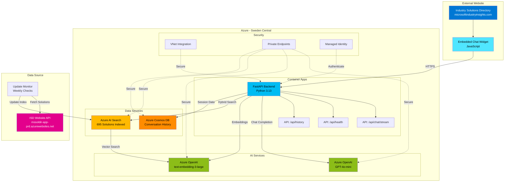
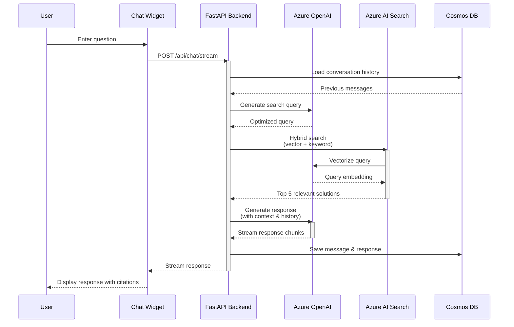
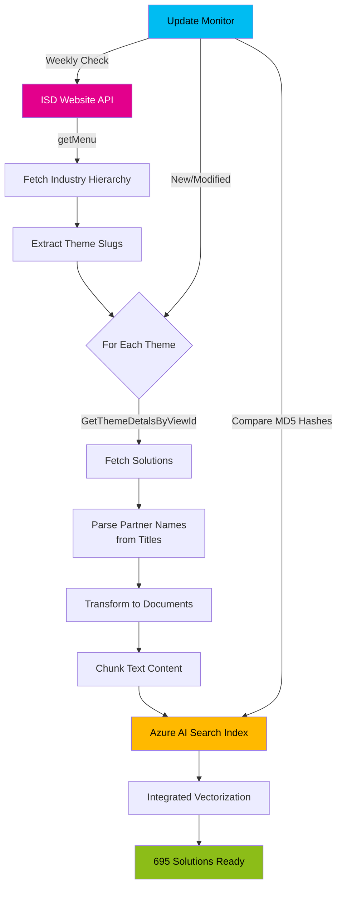

# Industry Solutions Directory - AI Chat Assistant Architecture

**Solution Owner:** Arturo Quiroga  
**Role:** Principal Industry Solutions Architect, Microsoft  
**Last Updated:** November 8, 2025  
**Purpose:** Comprehensive technical architecture for the AI-powered chat assistant that enables natural language search and intelligent partner solution recommendations for the Microsoft Industry Solutions Directory

## Executive Summary

This document outlines the pro-code architecture for adding intelligent chat capabilities to the Microsoft Industry Solutions Directory website (https://solutions.microsoftindustryinsights.com/dashboard). The solution enables natural language search and partner recommendations using Azure AI services.

## Business Requirements

Based on the discovery meeting with Will Casavan:
- **Primary Goal**: Add AI-powered search assistant to help users discover partner solutions through natural language queries
- **Key Capabilities**:
  - Conversational search interface
  - Context-aware recommendations
  - Multi-industry and technology filtering
  - Partner matching based on solution requirements
- **Constraints**:
  - Cost-effective solution
  - External website integration (not Microsoft-hosted)
  - Minimal disruption to existing site

## Solution Architecture

### High-Level Design



### RAG Pattern Flow



### Data Ingestion Flow



**Text Representation:**
```
┌─────────────────────────────────────────────────────────────────┐
│                    Existing Website                              │
│         https://solutions.microsoftindustryinsights.com         │
│                                                                  │
│  ┌────────────────────────────────────────────────────────┐    │
│  │         Embedded Chat Widget (JavaScript)              │    │
│  │  - Chat UI component                                   │    │
│  │  - Session management                                  │    │
│  │  - Real-time message streaming                         │    │
│  └─────────────────┬──────────────────────────────────────┘    │
└────────────────────┼───────────────────────────────────────────┘
                     │ HTTPS/WebSocket
                     ▼
┌─────────────────────────────────────────────────────────────────┐
│                   Azure App Service / Container Apps             │
│                      (Backend API - Python)                      │
│  ┌────────────────────────────────────────────────────────┐    │
│  │  FastAPI REST API                                      │    │
│  │  - POST /api/chat (chat endpoint)                      │    │
│  │  - GET /api/chat/history/{sessionId}                   │    │
│  │  - GET /api/health                                     │    │
│  │  - WebSocket /ws/chat                                  │    │
│  └────────────────────────────────────────────────────────┘    │
└───────┬────────────────┬────────────────┬───────────────────────┘
        │                │                │
        ▼                ▼                ▼
┌──────────────┐  ┌─────────────┐  ┌──────────────────┐
│ Azure OpenAI │  │   Azure AI  │  │  Azure Cosmos DB │
│              │  │   Search    │  │     (NoSQL)      │
│ - GPT-4.1    │  │             │  │                  │
│ - Embeddings │  │ - Vector DB │  │ - Chat history   │
│   (text-     │  │ - Hybrid    │  │ - User sessions  │
│    embedding │  │   search    │  │ - Analytics      │
│    -3-large) │  │ - RAG index │  │                  │
└──────────────┘  └─────────────┘  └──────────────────┘
```

### Component Details

#### 1. Frontend: Embeddable Chat Widget
**Technology**: JavaScript/TypeScript (React or Vanilla JS)
**Features**:
- Lightweight, embeddable component via `<script>` tag
- Responsive chat interface (desktop and mobile)
- Message history display
- Typing indicators and loading states
- Session persistence (localStorage + backend)
- Markdown rendering for rich responses
- Citation links to source solutions

**Integration Method**:
```html
<script src="https://your-cdn.azureedge.net/chat-widget.js"></script>
<script>
  IndustrySolutionsChat.init({
    apiEndpoint: 'https://your-api.azurewebsites.net',
    theme: 'light',
    position: 'bottom-right'
  });
</script>
```

#### 2. Backend API: Python FastAPI
**Technology**: Python 3.11+, FastAPI, Azure SDK
**Key Dependencies**:
- `fastapi` - Web framework
- `httpx` - HTTP client for Azure AI Search REST API calls
- `azure-cosmos` - Cosmos DB integration
- `azure-identity` - Azure authentication (DefaultAzureCredential)
- `azure-ai-inference` - Azure OpenAI chat completions
- `pydantic` - Data validation

**Architecture Decision**: Uses **direct REST API calls** to Azure AI Search instead of Python SDK (`azure-search-documents`) due to better support for integrated vectorization features. API version 2024-07-01 is explicitly specified.

**Core Endpoints**:
```python
POST /api/chat
  Request: { "message": str, "conversation_id": str, "filters": {...} }
  Response: { "response": str, "citations": [...], "session_id": str }

GET /api/chat/history/{sessionId}
  Response: { "messages": [...], "sessionId": str }

POST /api/feedback
  Request: { "messageId": str, "rating": int, "comment": str }
  
GET /api/health
  Response: { "status": "healthy", "dependencies": {...} }
```

#### 3. Azure AI Search: Vector & Hybrid Search
**Purpose**: Store and retrieve partner solution data
**Index Name**: `partner-solutions-integrated` (535 documents)
**Vector Configuration**:
- **Integrated Vectorization**: Automatic query vectorization using Azure OpenAI vectorizer
- **Vectorizer**: `openai-vectorizer`
  - Deployment: `text-embedding-3-large`
  - Dimensions: 3072
  - Resource: Azure OpenAI service with managed identity authentication
- **Vector Profile**: `integrated-vector-profile`

**Index Schema**:
```json
{
  "fields": [
    { "name": "id", "type": "Edm.String", "key": true },
    { "name": "solution_name", "type": "Edm.String", "searchable": true },
    { "name": "partner_name", "type": "Edm.String", "searchable": true, "facetable": true },
    { "name": "description", "type": "Edm.String", "searchable": true },
    { "name": "industries", "type": "Edm.String", "searchable": true, "filterable": true },
    { "name": "technologies", "type": "Edm.String", "searchable": true, "filterable": true },
    { "name": "solution_url", "type": "Edm.String" },
    { "name": "content_vector", "type": "Collection(Edm.Single)", "dimensions": 3072, "vectorSearchProfile": "integrated-vector-profile" },
    { "name": "chunk_text", "type": "Edm.String" },
    { "name": "metadata", "type": "Edm.String" }
  ]
}
```

**Search Strategy**:
- **Hybrid Search**: Combine vector search (semantic) with keyword search (BM25)
- **Integrated Vectorization**: User queries are automatically vectorized by Azure Search using the configured vectorizer
- **REST API Integration**: Direct REST API calls with `vectorQueries[].kind = "text"` for automatic vectorization
- **Filters**: Apply industry/technology filters using OData syntax (e.g., `search.ismatch('value', 'fieldname')`)
- **Top K**: Return top 3-5 results for RAG context

#### 4. Azure OpenAI: LLM & Embeddings
**Models**:
- **Chat**: `gpt-4.1` or `gpt-4.1-mini` (cost vs. performance trade-off)
- **Embeddings**: `text-embedding-3-large` (1536 dimensions)

**Usage**:
- Generate embeddings for solution content during indexing
- Generate embeddings for user queries
- LLM generates responses using RAG pattern with search results

**Prompt Engineering**:
```
System: You are an expert assistant for the Microsoft Industry Solutions Directory.
Your role is to help users find the right partner solutions based on their needs.

Context: {retrieved_solutions}

User Question: {user_message}

Instructions:
- Provide clear, concise recommendations
- Include partner names and solution links
- Ask clarifying questions if needed
- Focus on industry and technology fit
```

#### 5. Azure Cosmos DB: Conversation Storage
**Purpose**: Store chat history and user sessions
**Container Design**:
```json
{
  "id": "session-uuid",
  "sessionId": "session-uuid",
  "userId": "optional-user-id",
  "messages": [
    {
      "role": "user|assistant",
      "content": "...",
      "timestamp": "ISO-8601",
      "citations": [...]
    }
  ],
  "metadata": {
    "startTime": "ISO-8601",
    "lastActivity": "ISO-8601",
    "industry": "...",
    "technology": "..."
  }
}
```

**Partition Key**: `sessionId`
**Benefits**:
- Multi-user support with session isolation
- Conversation history for context
- Analytics on user queries and patterns
- Low latency for chat applications

#### 6. Data Ingestion Pipeline
**Purpose**: Scrape and index partner solutions from existing website
**Components**:
- Web scraper (Python: BeautifulSoup/Scrapy)
- Data cleaning and transformation
- Chunking strategy for long content
- Embedding generation via Azure OpenAI
- Batch upload to Azure AI Search

**Execution**:
- Initial full load
- Periodic updates (daily/weekly via Azure Functions or GitHub Actions)

## RAG Pattern Implementation

### Modern RAG with Integrated Vectorization (Current Implementation)
1. **User Input**: User asks "What partners offer healthcare AI solutions?"
2. **REST API Request**: Backend sends search request to Azure AI Search with:
   ```json
   {
     "search": "healthcare AI solutions",
     "vectorQueries": [{
       "kind": "text",
       "text": "healthcare AI solutions",
       "fields": "content_vector",
       "k": 3
     }]
   }
   ```
3. **Automatic Vectorization**: Azure Search service automatically:
   - Vectorizes the query text using the configured vectorizer (text-embedding-3-large)
   - No client-side embedding generation required
   - Performs hybrid search (vector + keyword)
4. **Apply Filters**: If specified, apply OData filters (e.g., `search.ismatch('Healthcare', 'industries')`)
5. **Retrieve Context**: Get top 3-5 relevant solution chunks with relevance scores
6. **LLM Generation**: Send context + query to GPT-4.1-mini:
   ```
   Context: [Retrieved solutions with relevance scores]
   Question: [User query]
   Generate a helpful response with partner recommendations
   ```
7. **Response**: Return formatted response with citations to user

**Benefits of Integrated Vectorization**:
- ✅ Reduced latency (no separate embedding API call)
- ✅ Lower cost (no client-side token usage for embeddings)
- ✅ Simplified code (no OpenAI embedding service needed for queries)
- ✅ Better reliability (fewer external API dependencies)

### Classic RAG Flow (Legacy, Not Used)
1. **User Input**: User asks "What partners offer healthcare AI solutions?"
2. **Query Embedding**: Convert query to vector using Azure OpenAI embeddings
3. **Hybrid Search**: Search Azure AI Search using:
   - Vector search for semantic similarity
   - Keyword search for exact matches
   - Filter by industry = "Healthcare & Life Sciences"
4. **Retrieve Context**: Get top 5-10 relevant solution chunks
5. **LLM Generation**: Send context + query to GPT-4.1:
   ```
   Context: [Retrieved solutions]
   Question: [User query]
   Generate a helpful response with partner recommendations
   ```
6. **Response**: Return formatted response with citations to user

### Modern RAG with Agentic Retrieval (Future Enhancement)
- Use Azure AI Search's agentic retrieval feature
- LLM plans and executes multiple sub-queries
- Better handling of complex, multi-faceted questions
- Improved citation and reasoning transparency

## Infrastructure as Code (Bicep)

### Azure Resources
```bicep
- Resource Group: indsolse-dev-rg
- Azure OpenAI Service
  - gpt-4.1-mini deployment (chat completions)
  - text-embedding-3-large deployment (3072 dimensions, for indexing)
- Azure AI Search (Standard tier)
  - Index: partner-solutions-integrated (535 documents)
  - Integrated vectorization enabled
- Azure Cosmos DB for NoSQL (Serverless)
  - Database: industry-solutions-db
  - Container: chat-sessions
- Azure Container Apps (for API and frontend)
  - Backend: indsolse-dev-backend-v2-vnet (v2.8)
  - Frontend: indsolse-dev-frontend-vnet
  - Container Registry: indsolsedevacr
- Azure Virtual Network (VNet integration)
- Azure Application Insights (monitoring)
```

**Current Deployment**:
- Region: Sweden Central
- Environment: Development
- Backend Version: v2.8 (REST API with integrated vectorization)
- Frontend: Streamlit-based chat interface

### Deployment Strategy
- Bicep templates in `/infra` directory
- Parameter files for dev/staging/prod environments
- GitHub Actions or Azure DevOps pipelines for CI/CD

## Security & Compliance

### Authentication & Authorization
- **API**: Azure AD authentication (optional for internal access)
- **Public Access**: API key or Azure AD B2C for external users
- **Rate Limiting**: Implement per-session/IP rate limits

### Data Privacy
- **Chat History**: Store only for limited time (30-90 days)
- **PII Handling**: Avoid storing sensitive user data
- **Compliance**: Follow Microsoft data handling guidelines

### Network Security
- **HTTPS Only**: Enforce TLS 1.2+
- **CORS**: Configure allowed origins (existing website domain)
- **Private Endpoints**: Optional for Azure services

## Monitoring & Observability

### Application Insights
- Request/response logging
- Error tracking and alerting
- Performance metrics (latency, throughput)
- Custom events (user queries, search quality)

### Azure Monitor
- Resource health checks
- Cost tracking
- Usage analytics

### Logging Strategy
- Structured logging (JSON format)
- Log levels: DEBUG, INFO, WARNING, ERROR
- Sensitive data redaction

## Cost Estimation (Monthly, USD)

### Pro-Code Approach
| Service | Configuration | Estimated Cost |
|---------|---------------|----------------|
| Azure OpenAI (GPT-4.1-mini) | ~500K tokens/day | $150 - $300 |
| Azure OpenAI (Embeddings) | ~100K tokens/day | $10 - $20 |
| Azure AI Search | Standard S1 (1 replica) | $250 |
| Azure Cosmos DB | Serverless (10GB, 1M RUs) | $25 - $50 |
| Azure App Service | B1 Basic tier | $13 |
| Azure Application Insights | Basic | $5 - $20 |
| Azure Key Vault | Standard | $1 |
| **Total (Low Traffic)** | | **$454 - $654** |
| **Total (Medium Traffic)** | | **$600 - $900** |

### Cost Optimization Tips
1. Use `gpt-4.1-nano` for simpler queries (cheaper)
2. Implement caching for common queries
3. Use Cosmos DB serverless for unpredictable traffic
4. Start with Azure AI Search Basic tier if <1000 queries/day
5. Monitor token usage and optimize prompts

### Low-Code Alternative (Copilot Studio)
| Component | Estimated Cost |
|-----------|----------------|
| Copilot Studio | $200/month (base plan) |
| Azure AI Search (if needed) | $250/month |
| **Total** | **$450/month** |

**Trade-offs**:
- **Pro-Code**: More control, customization, integration flexibility
- **Low-Code**: Faster time-to-market, easier maintenance, less code to manage

## Deployment & Integration

### Phase 1: Development & Testing (Weeks 1-2)
- Set up Azure resources
- Develop backend API
- Create data ingestion pipeline
- Build chat widget prototype
- Test RAG pattern with sample data

### Phase 2: Data Integration (Weeks 2-3)
- Scrape and index all partner solutions
- Validate search quality and relevance
- Fine-tune prompts and search parameters

### Phase 3: Frontend Integration (Week 3)
- Finalize chat widget design
- Integrate with existing website
- Test across browsers and devices

### Phase 4: Testing & Refinement (Week 4)
- User acceptance testing (UAT)
- Performance optimization
- Security review
- Documentation

### Phase 5: Production Deployment (Week 5)
- Deploy to production environment
- Monitor usage and performance
- Collect user feedback
- Iterate based on learnings

## Integration with Existing Website

### Option 1: Script Tag Injection
**Pros**: Easy to implement, minimal changes to existing site
**Cons**: Limited control over styling

```html
<!-- Add before closing </body> tag -->
<script src="https://cdn.yourservice.com/chat-widget.js"></script>
<script>
  window.IndustrySolutionsChat.init({
    apiEndpoint: 'https://api.yourservice.com',
    theme: 'auto', // auto, light, dark
    primaryColor: '#0078d4',
    position: 'bottom-right'
  });
</script>
```

### Option 2: iFrame Embedding
**Pros**: Complete isolation, custom styling
**Cons**: More complex, potential cross-origin issues

```html
<iframe 
  src="https://chat.yourservice.com/embed" 
  style="position: fixed; bottom: 20px; right: 20px; width: 400px; height: 600px; border: none;"
  allow="microphone"
></iframe>
```

### Option 3: Direct Integration (if site source available)
**Pros**: Full control, seamless UX
**Cons**: Requires access to site codebase

## Success Metrics

### Key Performance Indicators (KPIs)
1. **User Engagement**
   - Daily active users (DAU)
   - Average session length
   - Messages per session
   
2. **Search Quality**
   - Click-through rate on recommended solutions
   - User satisfaction ratings (thumbs up/down)
   - Refinement query rate

3. **Technical Performance**
   - API response time (p50, p95, p99)
   - Search relevance score
   - Error rate

4. **Business Impact**
   - Partner solution views driven by chat
   - Lead generation (if tracked)
   - User feedback quality

## Future Enhancements

1. **Agentic Retrieval**: Upgrade to Azure AI Search agentic retrieval for better multi-query handling
2. **Personalization**: User profiles and recommendation history
3. **Multi-language**: Support for international users
4. **Voice Interface**: Speech-to-text and text-to-speech
5. **Advanced Analytics**: Power BI dashboards for insights
6. **A/B Testing**: Experiment with different prompts and models
7. **Partner API**: Allow partners to update their solutions directly

## References & Resources

- [Azure AI Search RAG Overview](https://learn.microsoft.com/azure/search/retrieval-augmented-generation-overview)
- [Azure Cosmos DB Vector Search](https://learn.microsoft.com/azure/cosmos-db/nosql/vector-search)
- [Azure OpenAI Service Documentation](https://learn.microsoft.com/azure/ai-services/openai/)
- [FastAPI Documentation](https://fastapi.tiangolo.com/)
- [GitHub: Azure OpenAI + Search Demo](https://github.com/Azure-Samples/azure-search-openai-demo)

## Contact & Support

- **Technical Lead**: Arturo Quiroga
- **Product Owner**: Will Casavan
- **Development Team**: Jason, Thomas, Arturo
