# Industry Solutions Directory - AI Chat Assistant Architecture

**Solution Owner:** Arturo Quiroga  
**Role:** Principal Industry Solutions Architect, Microsoft  
**Last Updated:** February 16, 2026  
**Purpose:** Comprehensive technical architecture for the AI-powered chat assistant that enables natural language search and intelligent partner solution recommendations for the Microsoft Industry Solutions Directory

## Executive Summary

This document outlines the pro-code architecture for adding intelligent chat capabilities to the Microsoft Industry Solutions Directory website (https://solutions.microsoftindustryinsights.com/dashboard). The solution enables natural language search and partner recommendations using Azure AI services.

### Current Production Architecture

**This document describes the multi-agent NL2SQL architecture**, currently deployed on Azure Container Apps:
- **Production URLs**: See [README.md](README.md) for ACA endpoints
- **Architecture Pattern**: 4-agent pipeline (Query Planner → NL2SQL → Insight Analyzer → Response Formatter)
- **Use Case**: Web-based AI chat assistant for natural language queries against the Microsoft Solutions Directory
- **Status**: ✅ In production (v3.0-responses-api)
- **Models**: Per-agent model selection — gpt-5.2 (reasoning) for SQL generation, gpt-4.1 for other agents

### MCP Server (Separate Component)

The project also includes a **Model Context Protocol (MCP) server** as a separate component:
- **Location**: `mcp-isd-server/` directory
- **Purpose**: Provides Industry Solutions Directory data to MCP-compatible clients
- **Use Cases**: VS Code extensions, Claude Desktop, AI development tools
- **Architecture**: MCP protocol for IDE/tool integration
- **Status**: Separate deployment, NOT used by the production web app
- **Documentation**: See `deployment/MCP_DEPLOYMENT.md`

**Important**: These are two distinct architectures serving different purposes:
- **Traditional ACA** (this document): For web-based user interface
- **MCP Server**: For developer tools and IDE integration

## Business Requirements

Based on the discovery meeting with Will Casavan:
- **Primary Goal**: Add AI-powered search assistant to help users discover partner solutions through natural language queries
- **Key Capabilities**:
  - Conversational search interface
  - Context-aware recommendations
  - **Dual browsing support**: Industry-based AND Technology-based filtering
  - Partner matching based on solution requirements
  - Support for both browsing patterns:
    - **By Industry**: Defense, Education, Healthcare, Financial Services, etc.
    - **By Technology**: AI Business Solutions, Cloud and AI Platforms, Security, etc.
- **Constraints**:
  - Cost-effective solution
  - External website integration (not Microsoft-hosted)
  - Minimal disruption to existing site

## Solution Architecture

### Architecture Diagram (v3.0 — Multi-Agent NL2SQL Pipeline)

```mermaid
flowchart TB
    subgraph Frontend["React 19 + TypeScript"]
        UI[Chat Interface] -->|POST /api/query| API
        UI -->|POST /api/query/stream| SSE[SSE Stream]
    end

    subgraph Backend["FastAPI Backend"]
        API[REST API] --> Pipeline
        SSE --> Pipeline
    end

    subgraph Pipeline["Multi-Agent Pipeline"]
        direction TB
        A1["🧠 Agent 1: Query Planner\n─────────────────────\nIntent classification\nJSON Schema strict output\nprevious_response_id chaining"]
        A2["🔍 Agent 2: NL2SQL Executor\n─────────────────────\nSQL generation + validation\nJSON Schema strict output\npyodbc read-only execution"]
        A3["📊 Agent 3: Insight Analyzer\n─────────────────────\nPattern extraction\nStatistical analysis\nCitation generation"]
        A4["✍️ Agent 4: Response Formatter\n─────────────────────\nNarrative generation\nSSE streaming support\nprevious_response_id chaining"]
        A1 ==>|intent + routing| A2
        A2 ==>|SQL results| A3
        A3 ==>|insights| A4
    end

    subgraph LLM["Azure OpenAI"]
        GPT["gpt-4.1\nResponses API\nJSON Schema structured outputs"]
    end

    subgraph DB["SQL Server"]
        SQL[("dbo.vw_ISDSolution_All\n448 solutions · 174 partners\n10 industries · 3 solution areas")]
    end

    A1 -.->|responses.create| GPT
    A2 -.->|responses.create| GPT
    A3 -.->|responses.create| GPT
    A4 -.->|responses.create stream=True| GPT
    A2 ==>|READ-ONLY| SQL

    linkStyle 0,1,2,3 stroke:#4fc3f7,stroke-width:2px
    linkStyle 4,5,6 stroke:#ce93d8,stroke-width:3px
    linkStyle 7,8,9,10 stroke:#ffb74d,stroke-width:2px,stroke-dasharray:6
    linkStyle 11 stroke:#81c784,stroke-width:3px

    style Frontend fill:#e3f2fd,stroke:#1565c0,stroke-width:2px,color:#0d47a1
    style Backend fill:#e8eaf6,stroke:#283593,stroke-width:2px,color:#1a237e
    style Pipeline fill:#f3e5f5,stroke:#6a1b9a,stroke-width:2px,color:#4a148c
    style LLM fill:#fff3e0,stroke:#e65100,stroke-width:2px,color:#bf360c
    style DB fill:#e8f5e9,stroke:#2e7d32,stroke-width:2px,color:#1b5e20
```



### Agentic Flow Detail

```mermaid
sequenceDiagram
    participant U as User
    participant FE as React 19 Frontend<br/>(Vite + TypeScript)
    participant API as FastAPI Backend<br/>(Python 3.13)
    participant QP as Agent 1: Query Planner<br/>(gpt-4.1)
    participant SQL as Agent 2: NL2SQL<br/>(gpt-5.2 · low reasoning)
    participant DB as SQL Server<br/>(mssoldir-prd-sql)
    participant IA as Agent 3: Insight Analyzer<br/>(gpt-4.1)
    participant RF as Agent 4: Response Formatter<br/>(gpt-4.1)
    participant Cosmos as Azure Cosmos DB<br/>(Conversation History)

    U->>FE: Ask question<br/>(seller or customer mode)
    FE->>API: POST /api/chat/stream (SSE)
    activate API

    API->>Cosmos: Load conversation history
    Cosmos-->>API: Previous messages + response IDs

    API->>QP: Analyze user intent
    activate QP
    QP-->>API: intent: query | analyze | summarize | compare
    deactivate QP

    API->>SQL: Generate SQL from natural language
    activate SQL
    Note over SQL: Phrase Precision rules<br/>Domain-aware synonyms<br/>Defensive SQL (COALESCE, aliases)
    SQL-->>API: SQL query (JSON)
    deactivate SQL

    API->>DB: Execute SQL via pyodbc
    activate DB
    DB-->>API: Result rows (up to 50)
    deactivate DB

    API->>IA: Analyze patterns in results
    activate IA
    IA-->>API: Key findings, statistics,<br/>patterns, recommendations
    deactivate IA

    API->>RF: Format narrative response
    activate RF
    RF-->>API: Stream markdown (SSE chunks)
    deactivate RF

    API->>Cosmos: Save conversation
    API-->>FE: SSE stream: insights + data table
    deactivate API
    FE-->>U: Render response<br/>(Chart/Table tabs, exports)
```



### Component Details

#### 1. Frontend: React 19 Chat Application
**Technology**: React 19, TypeScript, Vite, Tailwind CSS
**Features**:
- Full-page chat application with dual-mode support (seller / customer)
- Responsive UI with Chart and Table tabs for data visualization
- SSE streaming for real-time response rendering
- Conversation export (JSON, Markdown, HTML) with mode tagging
- URL-based mode selection (`?mode=seller` or `?mode=customer`)
- Markdown rendering with syntax highlighting
- Session persistence via Cosmos DB

#### 2. Backend API: Python FastAPI
**Technology**: Python 3.11+, FastAPI, Azure SDK
**Key Dependencies**:
- `fastapi` - Web framework
- `httpx` - HTTP client for Azure AI Search REST API calls
- `azure-cosmos` - Cosmos DB integration
- `azure-identity` - Azure authentication (DefaultAzureCredential)
- `azure-ai-inference` - Azure OpenAI chat completions
- `pydantic` - Data validation

**Architecture Decision**: Uses **NL2SQL pipeline** to convert natural language to SQL queries against SQL Server directly, bypassing Azure AI Search for the query path. The OpenAI client uses `openai.OpenAI` (not `AzureOpenAI`) with `base_url` pointing to the Azure OpenAI `/openai/v1/` endpoint.

**Core Endpoints**:
```python
POST /api/chat/stream
  Request: { "question": str, "conversation_id": str }
  Response: SSE stream (insights narrative + structured data)

POST /api/query
  Request: { "question": str, "conversation_id": str }
  Response: { "success": bool, "insights": str, "data": {...} }

GET /api/health
  Response: { "status": "healthy", "mode": "seller|customer" }

POST /api/export
  Request: { "messages": [...], "format": "json|md|html", "mode": str }
```

#### 3. Azure AI Search: Vector & Hybrid Search
**Purpose**: Store and retrieve partner solution data
**Index Name**: `partner-solutions-integrated` (535 documents)
**Vector Configuration**:
- **Integrated Vectorization**: Automatic query vectorization using Azure OpenAI vectorizer
- **Vectorizer**: `openai-vectorizer`
  - Deployment: `text-embedding-3-large`
  - Dimensions: 3072
  - Resource: Azure OpenAI service with managed identity authentication
- **Vector Profile**: `integrated-vector-profile`

**Index Schema**:
```json
{
  "fields": [
    { "name": "id", "type": "Edm.String", "key": true },
    { "name": "solution_name", "type": "Edm.String", "searchable": true },
    { "name": "partner_name", "type": "Edm.String", "searchable": true, "facetable": true },
    { "name": "description", "type": "Edm.String", "searchable": true },
    { "name": "industries", "type": "Edm.String", "searchable": true, "filterable": true },
    { "name": "technologies", "type": "Edm.String", "searchable": true, "filterable": true },
    { "name": "solution_url", "type": "Edm.String" },
    { "name": "content_vector", "type": "Collection(Edm.Single)", "dimensions": 3072, "vectorSearchProfile": "integrated-vector-profile" },
    { "name": "chunk_text", "type": "Edm.String" },
    { "name": "metadata", "type": "Edm.String" }
  ]
}
```
**Important Fields for Dual Browsing Support**:
- **`industries`**: Supports industry-based queries (e.g., "Healthcare", "Education", "Financial Services")
- **`technologies`**: Supports technology-based queries (e.g., "AI Business Solutions", "Cloud and AI Platforms", "Security")
- Both fields are searchable and filterable, enabling users to browse by either dimension
**Search Strategy**:
- **Hybrid Search**: Combine vector search (semantic) with keyword search (BM25)
- **Integrated Vectorization**: User queries are automatically vectorized by Azure Search using the configured vectorizer
- **REST API Integration**: Direct REST API calls with `vectorQueries[].kind = "text"` for automatic vectorization
- **Dual Dimension Filtering**: Support both browsing patterns seamlessly
  - **Industry Filters**: Apply filters like `search.ismatch('Healthcare', 'industries')`
  - **Technology Filters**: Apply filters like `search.ismatch('AI Business Solutions', 'technologies')`
  - **Combined Filters**: Users can search by both dimensions (e.g., "AI solutions for Healthcare")
- **Intelligent Query Routing**: System automatically detects whether user is asking about industries or technologies
- **Top K**: Return top 3-5 results for RAG context

#### 4. Azure OpenAI: Per-Agent Model Configuration

Each agent in the multi-agent pipeline can use a different Azure OpenAI model deployment, configured via environment variables:

| Agent | Env Variable | Default Model | Reasoning | Why |
|-------|-------------|---------------|-----------|-----|
| Query Planner | `MODEL_QUERY_PLANNER` | `gpt-4.1` | None | Simple intent classification — fast model sufficient |
| NL2SQL Executor | `MODEL_NL2SQL` | `gpt-5.2` | Low | **Reasoning model produces significantly better SQL** |
| Insight Analyzer | `MODEL_INSIGHT_ANALYZER` | `gpt-4.1` | None | Pattern extraction — fast model sufficient |
| Response Formatter | `MODEL_RESPONSE_FORMATTER` | `gpt-4.1` | None | Narrative generation — fast model sufficient |

All agents fall back to `AZURE_OPENAI_CHAT_DEPLOYMENT_NAME` if their specific env var is not set.

##### gpt-5.2 Reasoning Model for NL2SQL — Findings

Extensive testing (February 2026) comparing gpt-4.1 vs gpt-5.2 with low reasoning effort for SQL generation revealed significant quality improvements:

**1. Domain-Aware Synonyms**

For a query like *"Show me solutions for anti-money laundering and financial crime prevention"*, gpt-5.2 automatically generates LIKE patterns for domain synonyms:
- `'%anti-money laundering%'`, `'%AML%'` (acronym)
- `'%financial crime%'`, `'%crime prevention%'`
- `'%sanctions screening%'`, `'%KYC%'`, `'%know your customer%'`

gpt-4.1 typically generates only the literal terms from the user's question.

**2. Phrase Precision**

gpt-5.2 consistently follows the prompt's Phrase Precision rule, keeping multi-word concepts as combined phrases:
- ✅ `LIKE '%campus management%'` → precise matches
- ❌ `LIKE '%campus%' OR LIKE '%management%'` → matches everything with "management" (false positives)

gpt-4.1 frequently split phrases into individual generic words, causing 50-result queries full of irrelevant matches.

**3. Defensive SQL**
- `COALESCE(v.solutionName, '')` for NULL safety
- Table aliases (`FROM dbo.vw_ISDSolution_All AS v`)
- Inline SQL comments (`-- campus management (phrase first, then specific fallback)`)
- Searches across more relevant columns (solutionPlayName, theme, industryThemeDesc)

**4. Consistency**

With gpt-4.1, the same question asked twice could produce wildly different SQL (one run: 11 results with precise phrases; another run: 50 results with split words). gpt-5.2 is much more consistent — both modes produce similar, high-quality SQL.

**5. Performance**

| Metric | gpt-4.1 | gpt-5.2 (low reasoning) |
|--------|---------|------------------------|
| SQL quality | Variable | Consistently high |
| Domain synonyms | Rarely added | Frequently added |
| Phrase precision | 50/50 | ~95% consistent |
| Pipeline time | ~20s | ~26-30s |
| False positive rate | High (up to 50% irrelevant) | Low (<10%) |

The ~8-10s additional latency is justified by the dramatically better SQL quality.

##### NL2SQL Phrase Precision Prompt Engineering

The NL2SQL system prompt includes a **Phrase Precision rule** (added February 2026) that instructs the LLM to:

1. **Keep multi-word concepts as combined LIKE phrases**: `'%campus management%'` not `'%campus%' OR '%management%'`
2. **Never use generic single-word wildcards alone**: Words like "management", "data", "system", "platform", "solution" are too broad
3. **Use the most domain-specific word as a fallback**: For "campus management", use `'%campus management%' OR '%campus%'` (— "campus" is specific, "management" is not)
4. **Combine with industry filters when available**: `'%administrative%' AND industryName = 'Education'`

This rule, combined with gpt-5.2's reasoning capability, produces highly precise SQL queries.

#### 5. Azure Cosmos DB: Conversation Storage
**Purpose**: Store chat history and user sessions
**Container Design**:
```json
{
  "id": "session-uuid",
  "sessionId": "session-uuid",
  "userId": "optional-user-id",
  "messages": [
    {
      "role": "user|assistant",
      "content": "...",
      "timestamp": "ISO-8601",
      "citations": [...]
    }
  ],
  "metadata": {
    "startTime": "ISO-8601",
    "lastActivity": "ISO-8601",
    "industry": "...",
    "technology": "..."
  }
}
```

**Partition Key**: `sessionId`
**Benefits**:
- Multi-user support with session isolation
- Conversation history for context
- Analytics on user queries and patterns
- Low latency for chat applications

#### 6. Data Ingestion Pipeline
**Purpose**: Scrape and index partner solutions from existing website
**Components**:
- Web scraper (Python: BeautifulSoup/Scrapy)
- Data cleaning and transformation
- Chunking strategy for long content
- Embedding generation via Azure OpenAI
- Batch upload to Azure AI Search

**Execution**:
- Initial full load
- Periodic updates (daily/weekly via Azure Functions or GitHub Actions)

## NL2SQL Pipeline Implementation (Current Architecture)

The current architecture bypasses Azure AI Search entirely for the query path. Instead, user questions are converted to SQL via the 4-agent pipeline and executed directly against SQL Server.

### Query Flow Example
1. **User Input**: "What partners offer healthcare AI solutions?"
2. **Query Planner** (gpt-4.1): Classifies intent as `query`, determines `needs_new_query: true`
3. **NL2SQL** (gpt-5.2, low reasoning): Generates SQL:
   ```sql
   SELECT DISTINCT v.solutionName, v.orgName, v.industryName, v.solutionAreaName
   FROM dbo.vw_ISDSolution_All AS v
   WHERE v.solutionStatus = 'Approved'
     AND (COALESCE(v.industryName, '') LIKE '%healthcare%'
       OR COALESCE(v.industryThemeDesc, '') LIKE '%healthcare%')
     AND (COALESCE(v.solutionAreaName, '') LIKE '%AI%'
       OR COALESCE(v.solutionPlayName, '') LIKE '%artificial intelligence%')
   ORDER BY v.orgName
   ```
4. **SQL Execution**: Runs query via pyodbc against `mssoldir-prd-sql.database.windows.net`
5. **Insight Analyzer** (gpt-4.1): Extracts patterns, statistics, key findings from result rows
6. **Response Formatter** (gpt-4.1): Creates executive-style narrative with market landscape, strategic insights
7. **Stream to Client**: SSE stream delivers insights narrative + structured data table

### Benefits over RAG
- ✅ **Precise filtering**: SQL WHERE clauses are exact, not similarity-based
- ✅ **Aggregation support**: COUNT, GROUP BY, ranking queries work natively
- ✅ **No embedding drift**: Results come from the authoritative SQL database
- ✅ **Domain synonyms**: gpt-5.2 reasoning model adds AML/KYC/etc. automatically
- ✅ **Dual browsing**: Industry AND technology filters via SQL predicates

## Infrastructure as Code (Bicep)

### Azure Resources
```bicep
- Resource Group: indsolse-dev-rg
- Azure OpenAI Service
  - gpt-4.1 deployment (Query Planner, Insight Analyzer, Response Formatter)
  - gpt-5.2 deployment (NL2SQL with low reasoning)
- Azure SQL Server (existing ISD production database)
  - View: dbo.vw_ISDSolution_All (read-only access via pyodbc)
- Azure Cosmos DB for NoSQL (Serverless)
  - Database: industry-solutions-db
  - Container: chat-sessions
- Azure Container Apps (4 apps)
  - Backend: indsolse-dev-backend
  - Frontend: indsolse-dev-frontend
  - MCP Server: indsolse-dev-mcp-server
  - Update Monitor: indsolse-dev-updatemon
  - Container Registry: indsolsedevacr
- Azure Virtual Network (VNet integration)
- Azure Application Insights (monitoring)
```

**Current Deployment**:
- Region: Sweden Central
- Environment: Development
- Backend Version: v3.0-responses-api (multi-agent NL2SQL pipeline)
- Frontend: React 19 chat application

### Deployment Strategy
- Bicep templates in `/infra` directory
- Parameter files for dev/staging/prod environments
- GitHub Actions or Azure DevOps pipelines for CI/CD

## Security & Compliance

### Authentication & Authorization
- **API**: Azure AD authentication (optional for internal access)
- **Public Access**: API key or Azure AD B2C for external users
- **Rate Limiting**: Implement per-session/IP rate limits

### Data Privacy
- **Chat History**: Store only for limited time (30-90 days)
- **PII Handling**: Avoid storing sensitive user data
- **Compliance**: Follow Microsoft data handling guidelines

### Network Security
- **HTTPS Only**: Enforce TLS 1.2+
- **CORS**: Configure allowed origins (existing website domain)
- **Private Endpoints**: Optional for Azure services

## Monitoring & Observability

### Application Insights
- Request/response logging
- Error tracking and alerting
- Performance metrics (latency, throughput)
- Custom events (user queries, search quality)

### Azure Monitor
- Resource health checks
- Cost tracking
- Usage analytics

### Logging Strategy
- Structured logging (JSON format)
- Log levels: DEBUG, INFO, WARNING, ERROR
- Sensitive data redaction

## Cost Estimation (Monthly, USD)

### Pro-Code Approach (v3.0 — NL2SQL Architecture)
| Service | Configuration | Estimated Cost |
|---------|---------------|----------------|
| Azure OpenAI (gpt-4.1) | 3 agents · ~400K tokens/day | $120 - $250 |
| Azure OpenAI (gpt-5.2) | NL2SQL agent · ~100K tokens/day (reasoning) | $80 - $150 |
| Azure SQL Server | Existing ISD production database (shared) | $0 (existing) |
| Azure Container Apps | 4 apps (backend, frontend, MCP, update-monitor) | $40 - $80 |
| Azure Container Registry | Basic tier | $5 |
| Azure Cosmos DB | Serverless (10GB, 1M RUs) | $25 - $50 |
| Azure Application Insights | Basic | $5 - $20 |
| Azure Key Vault | Standard | $1 |
| **Total (Low Traffic)** | | **$276 - $556** |
| **Total (Medium Traffic)** | | **$400 - $700** |

### Cost Optimization Tips
1. Use `gpt-4.1-nano` for Query Planner and Response Formatter (cheaper, sufficient for classification/formatting)
2. Implement caching for common NL2SQL queries (same question → same SQL)
3. Use Cosmos DB serverless for unpredictable traffic
4. Scale ACA to zero during off-hours (min replicas = 0)
5. Monitor token usage per agent and optimize prompts

### Low-Code Alternative (Copilot Studio)
| Component | Estimated Cost |
|-----------|----------------|
| Copilot Studio | $200/month (base plan) |
| **Total** | **$200/month** |

**Trade-offs**:
- **Pro-Code**: More control, customization, integration flexibility
- **Low-Code**: Faster time-to-market, easier maintenance, less code to manage

## Deployment & Integration

### Phase 1: Development & Testing (Weeks 1-2)
- Set up Azure resources
- Develop backend API
- Create data ingestion pipeline
- Build chat widget prototype
- Test RAG pattern with sample data

### Phase 2: Data Integration (Weeks 2-3)
- Scrape and index all partner solutions
- Validate search quality and relevance
- Fine-tune prompts and search parameters

### Phase 3: Frontend Integration (Week 3)
- Finalize chat widget design
- Integrate with existing website
- Test across browsers and devices

### Phase 4: Testing & Refinement (Week 4)
- User acceptance testing (UAT)
- Performance optimization
- Security review
- Documentation

### Phase 5: Production Deployment (Week 5)
- Deploy to production environment
- Monitor usage and performance
- Collect user feedback
- Iterate based on learnings

## Integration with Existing Website

### Option 1: Script Tag Injection
**Pros**: Easy to implement, minimal changes to existing site
**Cons**: Limited control over styling

```html
<!-- Add before closing </body> tag -->
<script src="https://cdn.yourservice.com/chat-widget.js"></script>
<script>
  window.IndustrySolutionsChat.init({
    apiEndpoint: 'https://api.yourservice.com',
    theme: 'auto', // auto, light, dark
    primaryColor: '#0078d4',
    position: 'bottom-right'
  });
</script>
```

### Option 2: iFrame Embedding
**Pros**: Complete isolation, custom styling
**Cons**: More complex, potential cross-origin issues

```html
<iframe 
  src="https://chat.yourservice.com/embed" 
  style="position: fixed; bottom: 20px; right: 20px; width: 400px; height: 600px; border: none;"
  allow="microphone"
></iframe>
```

### Option 3: Direct Integration (if site source available)
**Pros**: Full control, seamless UX
**Cons**: Requires access to site codebase

## Success Metrics

### Key Performance Indicators (KPIs)
1. **User Engagement**
   - Daily active users (DAU)
   - Average session length
   - Messages per session
   
2. **Search Quality**
   - Click-through rate on recommended solutions
   - User satisfaction ratings (thumbs up/down)
   - Refinement query rate

3. **Technical Performance**
   - API response time (p50, p95, p99)
   - Search relevance score
   - Error rate

4. **Business Impact**
   - Partner solution views driven by chat
   - Lead generation (if tracked)
   - User feedback quality

## Future Enhancements

1. **Agentic Retrieval**: Upgrade to Azure AI Search agentic retrieval for better multi-query handling
2. **Personalization**: User profiles and recommendation history
3. **Multi-language**: Support for international users
4. **Voice Interface**: Speech-to-text and text-to-speech
5. **Advanced Analytics**: Power BI dashboards for insights
6. **A/B Testing**: Experiment with different prompts and models
7. **Partner API**: Allow partners to update their solutions directly

## References & Resources

- [Azure AI Search RAG Overview](https://learn.microsoft.com/azure/search/retrieval-augmented-generation-overview)
- [Azure Cosmos DB Vector Search](https://learn.microsoft.com/azure/cosmos-db/nosql/vector-search)
- [Azure OpenAI Service Documentation](https://learn.microsoft.com/azure/ai-services/openai/)
- [FastAPI Documentation](https://fastapi.tiangolo.com/)
- [GitHub: Azure OpenAI + Search Demo](https://github.com/Azure-Samples/azure-search-openai-demo)

## Contact & Support

- **Technical Lead**: Arturo Quiroga
- **Product Owner**: Will Casavan
- **Development Team**: Jason, Thomas, Arturo
