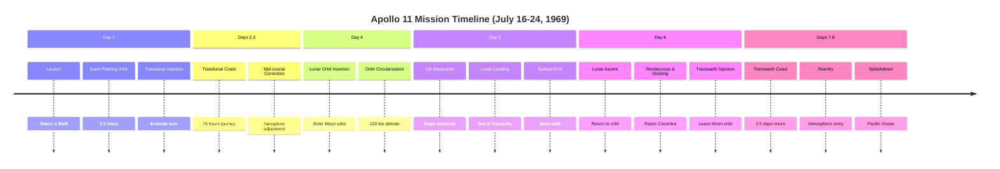
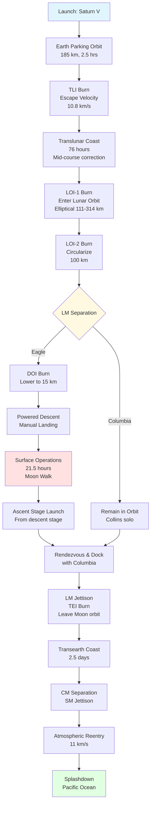

# Apollo 11 Orbital Trajectory: Earth to Moon

> **Question:** Explain to me in detail the orbit used by Apollo 11 to go from Earth to the Moon
>
> **Source:** grok-3 | December 14, 2025 at 6:37 PM

---

## Overview

The journey of Apollo 11 from Earth to the Moon in 1969 was a remarkable feat of engineering and orbital mechanics. The mission used a carefully planned trajectory involving multiple phases and orbits to ensure the spacecraft could escape Earth's gravity, travel to the Moon, enter lunar orbit, land on the Moon, and return safely.

### Mission Phases

The Apollo 11 mission involved several distinct orbital phases designed to optimize fuel efficiency, ensure precise navigation, and account for the gravitational influences of both Earth and the Moon:



#### Phase Breakdown

1. **Earth Parking Orbit** - Temporary low Earth orbit (LEO) to prepare for the journey
2. **Translunar Injection (TLI)** - Burn to escape Earth's gravity
3. **Translunar Coast** - Free-return trajectory to the Moon
4. **Lunar Orbit Insertion (LOI)** - Burn to enter orbit around the Moon
5. **Lunar Descent and Landing** - Descent from lunar orbit to the surface
6. **Lunar Ascent and Rendezvous** - Return to lunar orbit and dock with command module
7. **Transearth Injection (TEI)** - Burn to leave lunar orbit
8. **Transearth Coast and Reentry** - Journey back to Earth and atmospheric reentry

#### Visual Overview: Earth-Moon Transfer Orbit

```
                                    MOON
                                   ╭─────╮
                              LOI→ │  ○  │ ←TEI
                                   ╰─────╯
                                  ⟋       ⟍
                             ⟋   Lunar    ⟍
                        ⟋      Orbit       ⟍
                   ⟋          (100km)        ⟍
              ⟋                                 ⟍
         ⟋         Translunar Coast (3 days)      ⟍
    ⟋                                                 ⟍
  ╱                                                     ╲
⟋                Free-Return Trajectory                  ⟍
│                                                           │
│                                                           │
╲                                                           ╱
  ╲              Transearth Coast (2.5 days)            ╱
    ╲                                                 ╱
       ╲                                           ╱
          ╲                                     ╱
             ╲                               ╱
                ╲                         ╱
                   ╲                   ╱
                      ╲             ╱
                         ╲       ╱
                            ╲ ╱  
                  EARTH    ◉  ←TLI (Translunar Injection)
                          ╱ ╲  
                  Parking Orbit (185km)
```

---

## Detailed Mission Phases

### 1. Launch and Earth Parking Orbit

**Objective:** Place the Apollo 11 spacecraft into a stable low Earth orbit (LEO) to prepare for the journey to the Moon.

#### Details

- **Launch Date:** July 16, 1969
- **Launch Vehicle:** Saturn V rocket from Kennedy Space Center, Florida
- **Orbit Altitude:** ~185 km (115 miles) above Earth's surface
- **Orbit Inclination:** ~32.5° to the equator
- **Duration in Orbit:** ~2.5 hours (approximately 1.5 orbits)

The spacecraft (consisting of the Command/Service Module, or CSM, and the Lunar Module, or LM) remained in this orbit while the crew and ground control performed systems checks.

#### Why a Parking Orbit?

A parking orbit allowed the spacecraft to be positioned at the right point in space and time to perform the next critical maneuver, the Translunar Injection (TLI), ensuring the trajectory would intersect with the Moon's position about three days later.

```
                   PARKING ORBIT PHASE
                   (185 km altitude)
                      
              ╭────────────────────────╮
            ╱          ↻ Orbit         ╲
          ╱         Direction           ╲
        ╱                                 ╲
       │    ┌─────────────────────┐       │
      │     │   Systems Check     │        │
      │     │   • Navigation      │        │
     │      │   • Communications  │         │
     │      │   • Life Support    │         │
     │      └─────────────────────┘         │
      │         Duration: 2.5 hrs          │
      │         (~1.5 orbits)              │
       │                                   │
        ╲              ★ ← TLI Burn       ╱
          ╲            Point             ╱
            ╲                           ╱
              ╰────────────────────────╯
                         │
                         │
                    ┌────┴────┐
                    │  EARTH  │
                    │   🌍    │
                    └─────────┘
```

---

### 2. Translunar Injection (TLI)

**Objective:** Escape Earth's gravitational pull and set the spacecraft on a path toward the Moon.

#### Details

- **Engine:** Third stage of Saturn V (S-IVB stage) reignited
- **Burn Duration:** ~6 minutes
- **Final Velocity:** ~10.8 km/s (24,200 mph)
- **Earth's Escape Velocity:** ~11.2 km/s at that altitude

The trajectory was designed to be a **free-return trajectory** (or near-free-return), meaning that if no further maneuvers were performed, the spacecraft would loop around the Moon and return to Earth due to Earth's gravity. This was a critical safety measure.

#### Orbital Mechanics

The TLI burn transformed the circular parking orbit into a highly eccentric orbit, with:
- **Perigee** (closest point to Earth): Near parking orbit altitude
- **Apogee** (farthest point from Earth): Well beyond the Moon's orbit (~384,400 km)

The trajectory was carefully timed so that the spacecraft would reach the Moon's vicinity when the Moon was at the right position in its orbit around Earth.

```
              TRANSLUNAR INJECTION (TLI)
           Transforming Orbit: Circular → Elliptical

                         ╱
                       ╱
                     ╱          APOGEE
                   ╱            Beyond Moon
                 ╱              (>384,400 km)
               ╱
             ╱
           ╱
         ╱                    Highly Elliptical
       ╱                      Transfer Orbit
     ╱
   ╱
  │                           Velocity: 10.8 km/s
  │                           ═══════════════════
  │  ═══╗
  │     ║ TLI BURN ←────────── Duration: 6 minutes
  │  ═══╝                      Engine: S-IVB Stage
  │     ↑ Burn Point
  │    ╱
  │  ╱  ← Parking Orbit
  ◉══════  PERIGEE (~185 km)
  🌍
EARTH

           Before TLI          After TLI
           ═════════           ═══════════
           Circular            Elliptical
           Orbital             Escape
           Velocity            Velocity
           7.8 km/s            10.8 km/s
```

---

### 3. Translunar Coast

**Objective:** Travel from Earth to the Moon over a period of about 3 days.

#### Details

After the TLI burn:
1. The S-IVB stage was jettisoned
2. The CSM separated, turned around, and docked with the LM
3. The CSM extracted the LM from the S-IVB
4. The combined spacecraft continued on its journey

During the translunar coast, the spacecraft followed a passive trajectory, influenced primarily by Earth's gravity initially, and later by the Moon's gravity as it approached.

#### Mid-Course Corrections

Small burns using the CSM's engines were performed to fine-tune the path. **Apollo 11 required only one significant mid-course correction.**

#### Free-Return Trajectory

Early Apollo missions, including Apollo 11, used a free-return or near-free-return trajectory as a safety feature. For Apollo 11, the trajectory was slightly adjusted from a pure free-return to optimize the lunar landing site, but it still provided a reasonable return path in case of emergency.

---

### 4. Lunar Orbit Insertion (LOI)

**Objective:** Slow down the spacecraft to be captured by the Moon's gravity and enter a stable lunar orbit.

#### Details

- **Date:** July 19, 1969
- **Travel Time to Moon:** ~76 hours
- **Engine:** CSM's Service Propulsion System (SPS)
- **First Burn Duration:** ~6 minutes (retrograde burn)
- **Initial Orbit:**
  - **Perilune** (closest): ~111 km
  - **Apolune** (farthest): ~314 km
- **Second Burn:** Circularized orbit to ~100 km (62 miles) altitude

#### Orbital Mechanics

The Moon's gravity is much weaker than Earth's (about 1/6th), so the spacecraft needed to slow down significantly to avoid overshooting and escaping lunar orbit. The lunar orbit was inclined relative to the Moon's equator to align with the desired landing site in the **Sea of Tranquility** (Mare Tranquillitatis).

```
                    LUNAR ORBIT INSERTION (LOI)
                    Two-Burn Sequence

    PHASE 1: Initial Capture          PHASE 2: Circularization
    (LOI-1 Retrograde Burn)           (LOI-2 Adjustment)

         APOLUNE                             ⟲ Direction
         314 km ↓                      ╭─────────────╮
              ╱   ╲                  ╱               ╲
            ╱       ╲              ╱    100 km alt    ╲
          ╱           ╲          ╱       (Circular)     ╲
        ╱               ╲      ╱                         ╲
       │                 ╲    │         ┌─────┐           │
      │      ┌─────┐      │  │          │MOON │           │
      │      │MOON │      │  │          │ 🌑  │           │
      │      │ 🌑  │      │  │          └─────┘           │
       │     └─────┘     │    │                           │
        ╲               ╱      ╲                         ╱
          ╲           ╱          ╲                     ╱
            ╲       ╱              ╲                 ╱
              ╲   ╱ ← LOI-2          ╲             ╱
         ═══════╧═══                  ╰───────────╯
            ↑ LOI-1
       PERILUNE: 111 km              Stable Circular Orbit
       Burn: 6 minutes               Ready for LM operations
       Speed reduction
       to achieve capture

    Trajectory: Incoming → Elliptical → Circular
                  ═══════   ─ ─ ─ ─   ─────────
```

---

### 5. Lunar Descent and Landing

**Objective:** Separate the Lunar Module (LM) from the Command/Service Module (CSM) and land on the Moon.

#### Details

- **Date:** July 20, 1969
- **Crew:** Neil Armstrong and Buzz Aldrin in LM "Eagle"
- **Orbit:** Michael Collins remained in CSM "Columbia"
- **Descent Orbit Insertion (DOI):** Lowered perilune to ~15 km (9 miles)
- **Landing Time:** 20:17 UTC
- **Landing Site:** Sea of Tranquility
- **Fuel Remaining:** ~30 seconds worth

#### Notable Event

Armstrong manually piloted the final approach due to unexpected boulders at the planned landing site.

#### Orbital Mechanics

The descent was not a direct drop but a controlled trajectory from orbit, requiring precise timing and thrust to counteract lunar gravity and achieve a soft landing.

```
                    LUNAR DESCENT SEQUENCE

  CSM "Columbia" (Michael Collins)
       ↓
   ○─────○─────○─────○  ← Maintains 100 km circular orbit
  ⟲                ⟲     Awaits Eagle's return


  LM "Eagle" (Armstrong & Aldrin) Descent Path:
  
  ┌──────────────────────────────────────────────────────┐
  │  PHASE 1          PHASE 2           PHASE 3          │
  │  Separation       Powered Descent   Manual Landing   │
  └──────────────────────────────────────────────────────┘

      ▼ Separation
       ╲
        ╲ DOI Burn
         ╲ (Descent Orbit Insertion)
          ╲
           ╲ Perilune: 15 km
            ╲
         [▼] ← Descent Engine Fire
              ╲
               ╲ Braking Phase
                ╲ (Automatic)
                 ╲
              [▼] ═══════
                  ╲ Approach Phase
                   ╲ (Semi-automatic)
                    ╲
                 [▼] ═══════
                     ╲ Landing Phase
                      ╲ Armstrong takes
                       ╲ manual control
                        ╲ (Boulders detected)
                         ╲
                      [LM] ═══════
                       │\│  Throttle adjustment
━━━━━━━━━━━━━━━━━━━━━━━●━━━━━━━━━━━━━━━━━━━━━━━━
        🌑 SEA OF TRANQUILITY 🌑
           Touchdown!
    20:17 UTC, July 20, 1969
    Fuel remaining: ~30 seconds

    "The Eagle has landed."
```

---

### 6. Lunar Ascent and Rendezvous

**Objective:** Launch the LM's ascent stage back into lunar orbit and dock with the CSM.

#### Details

- **Surface Time:** ~21.5 hours
- **Launch Date:** July 21, 1969
- **Launch Platform:** LM descent stage
- **Crew:** Armstrong and Aldrin
- **Orbit Altitude:** ~100 km (matching CSM orbit)

After docking, the crew transferred back to the CSM, and the LM ascent stage was jettisoned.

#### Orbital Mechanics

Rendezvous required precise calculations to match the orbits of the LM and CSM, adjusting for differences in altitude and orbital plane.

---

### 7. Transearth Injection (TEI)

**Objective:** Escape lunar orbit and set the spacecraft on a trajectory back to Earth.

#### Details

- **Date:** July 22, 1969
- **Engine:** CSM's SPS engine
- **Burn Duration:** ~2.5 minutes (prograde burn)
- **Journey Time:** ~2.5 days back to Earth

#### Orbital Mechanics

The TEI burn had to be precisely timed to ensure the spacecraft would intersect Earth's atmosphere at the correct angle for reentry.

---

### 8. Transearth Coast and Reentry

**Objective:** Travel back to Earth and safely reenter the atmosphere for landing.

#### Details

- **Splashdown Date:** July 24, 1969
- **Location:** Pacific Ocean, ~1,440 km (900 miles) southwest of Hawaii
- **Reentry Velocity:** ~11 km/s (24,600 mph)
- **Service Module:** Jettisoned before reentry
- **Landing Method:** Parachutes deployed for ocean splashdown

#### Orbital Mechanics

The **reentry corridor** (the acceptable range of angles for entering the atmosphere) was narrow:
- **Too steep:** Excessive heating and structural failure
- **Too shallow:** Skip off the atmosphere

---

## Key Orbital Characteristics and Challenges

### Three-Body Problem

The trajectory planning had to account for the gravitational influences of:
- Earth
- The Moon
- The Sun (to a lesser extent)

This complex "three-body problem" was solved using numerical methods and approximations (e.g., patched conic approximation).

### Timing and Alignment

- Launch window and trajectory were chosen based on the relative positions of Earth and the Moon
- The Moon moves ~13° per day in its orbit
- Timing was critical to ensure the spacecraft arrived at the right place

### Fuel Efficiency

- The free-return trajectory and other maneuvers were designed to minimize fuel use while maintaining safety
- Each burn (TLI, LOI, TEI) had to be precisely calculated to avoid wasting propellant

### Navigation

Navigation relied on:
- Ground-based tracking
- Onboard star sightings
- Computer calculations using the Apollo Guidance Computer (AGC)
- Mid-course corrections to compensate for small trajectory errors

---

## Summary of Orbits Used by Apollo 11

| Phase | Orbit Type | Altitude/Details |
|-------|-----------|------------------|
| **Earth Parking** | Circular LEO | ~185 km altitude |
| **Translunar Trajectory** | Highly elliptical | Free-return/near-free-return path |
| **Lunar Orbit** | Circular | ~100 km altitude around Moon |
| **Descent Orbit** | Elliptical | Lowering to ~15 km at perilune |
| **Transearth Trajectory** | Return path | From lunar orbit to Earth reentry |

---

## Mission Flow Diagram



---

## NASA Resources & Images

### Official NASA Imagery

For high-quality diagrams and photographs of the Apollo 11 mission:

- **[Apollo 11 Image Gallery](https://www.nasa.gov/mission_pages/apollo/apollo-11.html)** - Official NASA collection
- **[Apollo Flight Journal](https://history.nasa.gov/afj/ap11fj/index.html)** - Detailed mission timeline with diagrams
- **[Lunar Orbit Diagrams](https://www.nasa.gov/centers/johnson/pdf/584722main_Wings-ch4b-pgs182-199.pdf)** - Technical orbital mechanics illustrations
- **[Apollo Trajectory Graphics](https://ntrs.nasa.gov/)** - NASA Technical Reports Server

### Recommended Diagrams to Add

1. **Free-Return Trajectory** - Shows safety path around Moon
2. **Saturn V Staging** - Visual breakdown of rocket stages
3. **CSM/LM Configuration** - Spacecraft component views
4. **Lunar Surface Map** - Landing site location in Sea of Tranquility
5. **Reentry Corridor** - Atmospheric entry angle visualization

---

## Conclusion

The orbital path of Apollo 11 was a masterpiece of planning and execution, relying on precise calculations of orbital mechanics, gravitational interactions, and propulsion. Each phase was critical to the mission's success:

- Earth parking orbit provided a stable starting point
- Translunar injection enabled escape from Earth's gravity
- Lunar orbit insertion captured the spacecraft around the Moon
- Precise descent and ascent maneuvers facilitated the lunar landing
- Transearth injection brought the crew home safely

The use of a **free-return trajectory** provided a safety net, while **mid-course corrections** ensured accuracy. This mission demonstrated humanity's ability to navigate the complexities of space travel and achieve a lunar landing, paving the way for future exploration.

---

*For further questions about specific maneuvers, the mathematics of orbital mechanics, or how integral calculus applies to trajectory calculations, feel free to ask!*

---

## Modern Context: Can We Do It Today?

> **Question:** Can this be done with today's technology, rockets, and engineers (millennials)?

Yes, returning to the Moon is not only possible but is currently underway through the **Artemis Program**. However, the approach, technology, and workforce have evolved significantly since 1969.

### 1. Technology: Then vs. Now

| Feature | Apollo (1969) | Artemis (Today) |
| :--- | :--- | :--- |
| **Computing** | **Apollo Guidance Computer (AGC):** <br>• 2KB RAM, 36KB ROM<br>• 1 MHz speed<br>• Manual inputs required | **Modern Avionics:**<br>• Multi-core processors, GBs of RAM<br>• Autonomous docking & landing<br>• Touchscreens & glass cockpits |
| **Navigation** | Ground tracking + Sextant star sightings | GPS (near Earth), Deep Space Network, Optical Navigation |
| **Materials** | Aluminum alloys, honeycomb structures | Carbon fiber composites, 3D-printed parts, lighter alloys |
| **Safety** | Single points of failure, limited redundancy | "Man-rating" standards, multiple redundant systems, launch abort systems |

**Key Difference:** Today's technology allows for **automation**. Where Neil Armstrong had to manually fly the LM to avoid boulders, modern landers (like SpaceX's Starship HLS) use terrain-relative navigation to land autonomously with centimeter precision.

### 2. Rockets: Saturn V vs. SLS & Starship

We are no longer relying on the retired Saturn V. Two major launch systems are leading the return:

*   **NASA's Space Launch System (SLS):**
    *   **Role:** Launches the crew in the Orion capsule.
    *   **Status:** Operational (Artemis I successful in 2022).
    *   **Comparison:** More powerful thrust at liftoff than Saturn V (8.8M lbs vs 7.6M lbs), but similar payload capacity to TLI.

*   **SpaceX Starship:**
    *   **Role:** Selected as the **Human Landing System (HLS)**.
    *   **Status:** In active flight testing.
    *   **Innovation:** Fully reusable, methane-fueled (Raptor engines), and capable of refuelling in orbit—a capability Apollo never had.

### 3. The Mission Profile: A New Orbit

We are not simply repeating the Apollo trajectory. The Artemis architecture uses a different orbital approach:

*   **Apollo:** Direct flight to Low Lunar Orbit (LLO), land, and return. Short duration (days).
*   **Artemis:** Uses a **Near-Rectilinear Halo Orbit (NRHO)**.
    *   **Why?** It is a stable "parking spot" for the **Lunar Gateway** (a small space station).
    *   **Benefit:** Constant communication with Earth, access to the Lunar South Pole (where water ice exists), and lower fuel requirements for station-keeping.

### 4. The Engineers: The "Millennial" Workforce

The Apollo workforce was famously young—the average age of mission controllers during Apollo 11 was **28**. Today's aerospace workforce is a mix of deep experience and new energy:

*   **NASA:** The workforce has an average age of ~46, providing institutional memory and safety culture.
*   **NewSpace (SpaceX, Blue Origin, etc.):** These companies are driven largely by **Millennials and Gen Z**.
    *   The average age at SpaceX is often cited in the **early 30s**.
    *   This generation has pioneered **reusable rockets** (landing boosters), rapid prototyping, and software-centric design.

**Verdict:** The "Millennial" engineers have already proven they can revolutionize spaceflight by landing orbital class rockets—something the Apollo generation dreamed of but couldn't achieve with 1960s analog technology. The challenge today is not *physics*, but **budget, sustainability, and complexity**.
