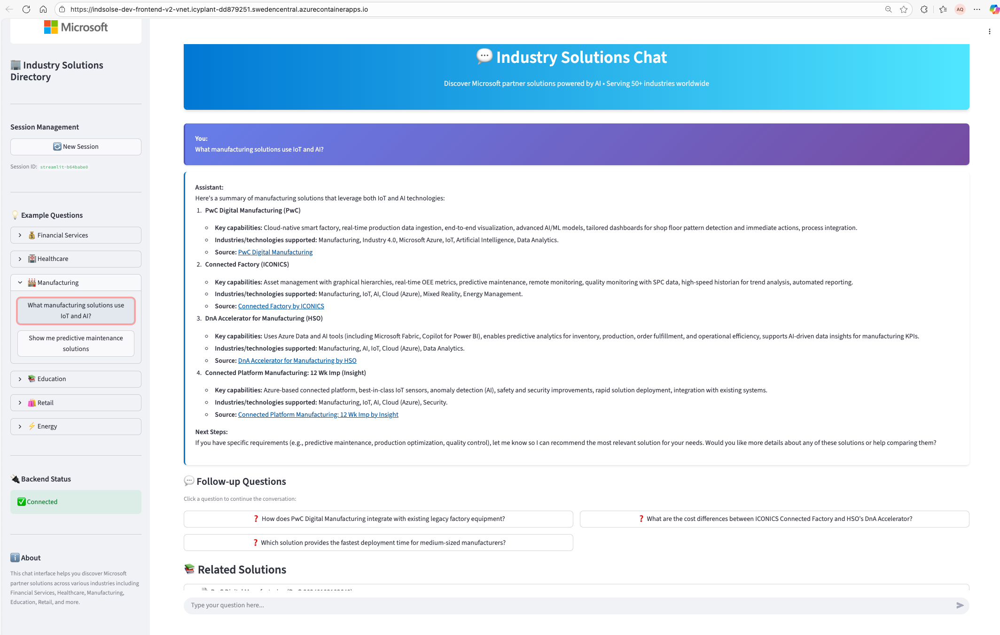

# Industry Solutions Directory - AI Chat Assistant

A pro-code solution to add intelligent chat capabilities to the Microsoft Industry Solutions Directory website using Azure AI services and the RAG (Retrieval-Augmented Generation) pattern.

## Overview

This solution enables natural language search and partner recommendations through a conversational AI interface integrated into the existing Industry Solutions Directory website at `https://solutions.microsoftindustryinsights.com/dashboard`.

## Screenshots

### Enhanced Chat Interface



*Modern, Microsoft-branded chat interface with:*
- 🎨 Azure blue gradient backgrounds and professional styling
- 💬 Conversational AI powered by Azure OpenAI
- 🏢 Microsoft branding with industry-specific icons
- 🔍 Intelligent search across 50+ industries
- 📚 Citation cards with solution details and relevance scores

**Live Demo:** [Try it here](https://indsolse-dev-frontend-vnet.icyplant-dd879251.swedencentral.azurecontainerapps.io)
**API Endpoint:** https://indsolse-dev-backend-v2-vnet.icyplant-dd879251.swedencentral.azurecontainerapps.io
**Current Version:** v2.8 (REST API with integrated vectorization)

### Key Features

- **Natural Language Search**: Users can ask questions in plain English about partner solutions
- **Contextual Recommendations**: AI-powered matching of user needs with relevant solutions
- **Multi-Industry Support**: Filter by industry categories (Healthcare, Financial Services, Retail, etc.)
- **Technology Filtering**: Search by technology stack (AI, Cloud, Security, etc.)
- **Conversation Memory**: Maintains context across multiple turns
- **Source Citations**: Provides links to actual partner solutions

## Architecture

The solution uses a modern RAG architecture with the following components:

### Backend (Python FastAPI)
- REST API for chat interactions
- **Direct REST API integration** with Azure AI Search (no Python SDK)
- **Integrated vectorization** using Azure AI Search vectorizer (automatic query vectorization)
- Integration with Azure OpenAI for LLM chat completions
- Azure Cosmos DB for conversation persistence
- Passwordless authentication via DefaultAzureCredential

### Frontend (JavaScript Widget)
- Lightweight embeddable chat widget
- Can be integrated via simple `<script>` tag
- Responsive design for desktop and mobile

### Data Pipeline
- Web scraping and indexing scripts
- Automated chunking and vectorization
- Scheduled updates for fresh content

## Project Structure

```
Industry-Solutions-Directory-PRO-Code/
├── backend/                    # Python FastAPI backend
│   ├── app/
│   │   ├── api/               # API endpoints
│   │   ├── services/          # Azure service integrations
│   │   │   ├── search_service.py     # Azure AI Search
│   │   │   ├── openai_service.py     # Azure OpenAI
│   │   │   └── cosmos_service.py     # Azure Cosmos DB
│   │   ├── models/            # Data models
│   │   ├── config.py          # Configuration
│   │   └── main.py            # FastAPI app
│   ├── requirements.txt       # Python dependencies
│   └── .env.example          # Environment variables template
├── frontend/                  # Chat widget (JavaScript/React)
│   ├── src/
│   ├── package.json
│   └── README.md
├── data-ingestion/           # Data scraping and indexing
│   ├── ingest_data.py        # Main ingestion script
│   └── requirements.txt
├── infra/                    # Infrastructure as Code (Bicep)
│   ├── main.bicep           # Main infrastructure template
│   ├── parameters/          # Environment-specific parameters
│   └── modules/             # Bicep modules
├── .github/workflows/        # CI/CD pipelines
│   └── deploy.yml
├── docs/                     # Additional documentation
├── discovery-meeting/        # Project discovery notes
├── ARCHITECTURE.md           # Detailed architecture documentation
└── README.md                # This file
```

## Prerequisites

- **Azure Subscription** with the following services:
  - Azure OpenAI Service (with text-embedding-3-large and gpt-4.1-mini deployments)
  - Azure AI Search (Basic tier or higher)
  - Azure Cosmos DB for NoSQL (Serverless recommended)
  - Azure App Service or Container Apps
  - **Azure CLI authentication** configured (passwordless auth)

- **Development Tools**:
  - Python 3.11+
  - Node.js 18+ (for frontend widget)
  - Azure CLI (logged in with `az login`)
  - Git

## Authentication

This solution uses **Azure CLI authentication (DefaultAzureCredential)** throughout - no API keys required. Ensure you:

1. Run `az login` before local development
2. Grant appropriate RBAC roles to your identity:
   - **Azure OpenAI**: `Cognitive Services OpenAI User`
   - **Azure AI Search**: `Search Index Data Contributor`, `Search Service Contributor`
   - **Azure Cosmos DB**: `Cosmos DB Built-in Data Contributor`

## Quick Start

### 1. Clone the Repository

```bash
git clone https://github.com/your-org/Industry-Solutions-Directory-PRO-Code.git
cd Industry-Solutions-Directory-PRO-Code
```

### 2. Set Up Azure Resources

#### Option A: Using Bicep (Recommended)

```bash
cd infra
az login
az deployment sub create \
  --location eastus \
  --template-file main.bicep \
  --parameters parameters/dev.parameters.json
```

#### Option B: Manual Setup

Create the following Azure resources manually through the Azure Portal:
1. Azure OpenAI Service with deployments:
   - `gpt-4.1-mini` (or `gpt-4o`)
   - `text-embedding-3-large`
2. Azure AI Search (Standard tier)
3. Azure Cosmos DB for NoSQL (Serverless)
4. Azure App Service (B1 or higher)

### 3. Configure Environment Variables

```bash
cd backend
cp .env.example .env
```

Edit `.env` and configure Azure service endpoints (no API keys needed):

```env
# Azure OpenAI Configuration
AZURE_OPENAI_ENDPOINT=https://your-openai.openai.azure.com/
AZURE_OPENAI_API_VERSION=2024-02-01
AZURE_OPENAI_CHAT_DEPLOYMENT=gpt-4-1-mini
AZURE_OPENAI_EMBEDDING_DEPLOYMENT=text-embedding-3-large
# Note: Using Azure CLI authentication (no API key needed)

# Azure AI Search Configuration
AZURE_SEARCH_ENDPOINT=https://your-search.search.windows.net
AZURE_SEARCH_INDEX_NAME=partner-solutions-integrated
# Note: Using Azure CLI authentication (no API key needed)
# Note: Index uses integrated vectorization (automatic query vectorization)

# Azure Cosmos DB Configuration
AZURE_COSMOS_ENDPOINT=https://your-cosmos.documents.azure.com:443/
AZURE_COSMOS_DATABASE_NAME=industry-solutions-db
AZURE_COSMOS_CONTAINER_NAME=chat-sessions
# Note: Using Azure CLI authentication (no key needed)

# Chat Configuration
MAX_HISTORY_MESSAGES=10
MAX_CONTEXT_TOKENS=4000
TEMPERATURE=0.7
TOP_P=0.95

# Search Configuration
SEARCH_TOP_K=5
VECTOR_SEARCH_THRESHOLD=0.7
```

**Important**: This solution uses passwordless authentication via Azure CLI. Make sure you're logged in with `az login` and have the required RBAC permissions.

### 4. Run Data Ingestion

Index partner solution data from the Industry Solutions Directory API into Azure AI Search:

```bash
cd data-ingestion
pip install -r requirements.txt

# Test with limited data first (2 industries, 5 solutions per theme)
python ingest_data_test.py

# Verify the indexed data
python verify_index.py

# Full ingestion (all 10 industries, ~20-30 minutes)
python ingest_data.py
```

**Data Source**: The ingestion scripts pull real data from `https://mssoldir-app-prd.azurewebsites.net/api/Industry/` endpoints:
- `getMenu` - Lists all industries and themes
- `GetThemeDetalsByViewId?slug={themeSlug}` - Gets partner solutions for each theme

**Vector Configuration**: 
- Index: `partner-solutions-integrated` with **integrated vectorization**
- Vectorizer: Azure OpenAI `text-embedding-3-large` (3072 dimensions)
- Automatic query vectorization: Queries are vectorized by Azure Search service
- No client-side embedding generation required

See `data-ingestion/API_INVESTIGATION.md` for details on the data source discovery process.

### 5. Run the Backend API Locally

```bash
cd backend
pip install -r requirements.txt

# Make sure you're logged in with Azure CLI
az login

# Start the FastAPI server
uvicorn app.main:app --reload --port 8000
```

The API will be available at `http://localhost:8000`

API Documentation: `http://localhost:8000/docs`

**Troubleshooting**:
- If you get Cosmos DB firewall errors, add your public IP to the firewall:
  ```bash
  az cosmosdb update --name your-cosmos-name --resource-group your-rg --ip-range-filter YOUR_PUBLIC_IP
  ```
- Ensure all RBAC permissions are granted (see Prerequisites)

### 6. Test the API

```bash
# Health check
curl http://localhost:8000/api/health

# Get available facets (industries, technologies)
curl http://localhost:8000/api/facets

# Chat request
curl -X POST http://localhost:8000/api/chat \
  -H "Content-Type: application/json" \
  -d '{
    "message": "What healthcare AI solutions are available?",
    "filters": {
      "industries": ["Healthcare & Life Sciences"]
    }
  }'
```

**Expected Response**: The chat endpoint will return AI-generated recommendations with citations linking to actual partner solutions.

### 7. Build and Deploy Frontend Widget

```bash
cd frontend
npm install
npm run build
```

Deploy the built widget to Azure CDN or Static Web Apps.

### 8. Integrate into Existing Website

Add the following code to the Industry Solutions Directory website:

```html
<!-- Add before closing </body> tag -->
<script src="https://your-cdn.azureedge.net/chat-widget.js"></script>
<script>
  window.IndustrySolutionsChat.init({
    apiEndpoint: 'https://your-api.azurewebsites.net',
    theme: 'auto',
    primaryColor: '#0078d4',
    position: 'bottom-right'
  });
</script>
```

## API Endpoints

### `POST /api/chat`
Main chat endpoint for user queries.

**Request:**
```json
{
  "message": "What partners offer financial services solutions?",
  "session_id": "optional-session-id",
  "filters": {
    "industries": ["Financial Services"],
    "technologies": ["AI"]
  }
}
```

**Response:**
```json
{
  "response": "Based on your query, I found several financial services solutions...",
  "session_id": "550e8400-e29b-41d4-a716-446655440000",
  "citations": [
    {
      "solution_name": "Financial Risk Management Suite",
      "partner_name": "FinTech Solutions Corp",
      "description": "Advanced risk management...",
      "url": "https://solutions.example.com/...",
      "relevance_score": 0.95
    }
  ],
  "message_id": "msg-12345"
}
```

### `GET /api/chat/history/{session_id}`
Retrieve chat history for a session.

### `POST /api/feedback`
Submit user feedback on responses.

### `GET /api/health`
Health check endpoint for monitoring.

## Configuration

All configuration is managed through environment variables. See `backend/app/config.py` for available settings.

### Key Settings

- `MAX_HISTORY_MESSAGES`: Number of conversation turns to keep in context (default: 10)
- `MAX_CONTEXT_TOKENS`: Maximum tokens for RAG context (default: 4000)
- `TEMPERATURE`: LLM temperature for response generation (default: 0.7)
- `SEARCH_TOP_K`: Number of search results to retrieve (default: 5)

## Deployment

### Deploy to Azure App Service

```bash
cd backend

# Create a web app
az webapp up \
  --name industry-solutions-chat-api \
  --resource-group your-rg \
  --runtime "PYTHON:3.11" \
  --sku B1

# Configure app settings
az webapp config appsettings set \
  --name industry-solutions-chat-api \
  --resource-group your-rg \
  --settings @appsettings.json
```

### Deploy with GitHub Actions

The repository includes a GitHub Actions workflow (`.github/workflows/deploy.yml`) for automated deployment.

1. Add Azure credentials as GitHub secrets
2. Push to `main` branch to trigger deployment

## Monitoring & Observability

The solution includes:

- **Application Insights** integration for telemetry
- **Structured logging** with correlation IDs
- **Health check endpoints** for service monitoring
- **Error tracking** and alerting

View logs and metrics in Azure Portal > Application Insights.

## Cost Estimation

### Monthly Costs (Low to Medium Traffic)

| Service | Configuration | Estimated Cost |
|---------|--------------|----------------|
| Azure OpenAI | GPT-4.1-mini (~500K tokens/day) | $150-300 |
| Azure OpenAI | Embeddings (~100K tokens/day) | $10-20 |
| Azure AI Search | Standard S1 | $250 |
| Azure Cosmos DB | Serverless (10GB, 1M RUs) | $25-50 |
| Azure App Service | B1 Basic | $13 |
| Application Insights | Basic | $5-20 |
| **Total** | | **$453-653/month** |

### Cost Optimization Tips

1. Use `gpt-4.1-nano` for simpler queries (80% cheaper)
2. Implement response caching for common questions
3. Use Cosmos DB serverless for variable traffic
4. Start with AI Search Basic tier for < 1000 queries/day

## Development

### Running Tests

```bash
cd backend
pytest tests/
```

### Code Quality

```bash
# Format code
black app/
isort app/

# Lint
pylint app/
```

## Troubleshooting

### Common Issues

**Issue**: Pydantic validation error for `applicationinsights_connection_string`
- **Solution**: The config now includes `extra = "ignore"` to allow optional fields in `.env`

**Issue**: Vector dimension mismatch (1536 vs 3072)
- **Solution**: The `text-embedding-3-large` model produces 3072-dimension vectors. Index uses integrated vectorization.

**Issue**: "Field 'content_vector' does not have a vectorizer defined" error
- **Solution**: This was caused by Python SDK (azure-search-documents 11.6.0) incompatibility with integrated vectorization. **Fixed in v2.8** by switching to direct REST API calls with API version 2024-07-01.

**Issue**: Cosmos DB firewall blocking local development
- **Solution**: Add your public IP to the firewall allow list:
  ```bash
  # Get your public IP
  curl ifconfig.me
  
  # Add to Cosmos DB firewall
  az cosmosdb update \
    --name your-cosmos-name \
    --resource-group your-rg \
    --ip-range-filter YOUR_PUBLIC_IP
  ```

**Issue**: Azure authentication errors
- **Solution**: Ensure you're logged in with `az login` and have the required RBAC roles assigned

**Issue**: Search returns no results
- **Solution**: Verify the index exists and contains data. Run `python data-ingestion/verify_index.py` to check.

**Issue**: OpenAI API rate limit errors
- **Solution**: Implement retry logic with exponential backoff (included in code)

**Issue**: CORS errors from frontend
- **Solution**: Add your website domain to `cors_origins` in `config.py` or `.env`

### Debug Mode

Enable debug logging:

```bash
export DEBUG=True
python -m app.main
```

## Contributing

1. Fork the repository
2. Create a feature branch (`git checkout -b feature/amazing-feature`)
3. Commit your changes (`git commit -m 'Add amazing feature'`)
4. Push to the branch (`git push origin feature/amazing-feature`)
5. Open a Pull Request

## Team & Contact

- **Technical Lead**: Arturo Quiroga
- **Product Owner**: Will Casavan
- **Development Team**: Jason, Thomas, Arturo

For questions or support, contact the team via Microsoft Teams.

## License

This project is proprietary and confidential.

## Acknowledgments

- Built with [FastAPI](https://fastapi.tiangolo.com/)
- Powered by [Azure AI Services](https://azure.microsoft.com/services/ai-services/)
- Based on Microsoft RAG best practices

## Next Steps

After initial deployment:

1. **Gather User Feedback**: Collect usage data and user satisfaction metrics
2. **Optimize Prompts**: Refine system prompts based on real queries
3. **Add Features**: Implement voice interface, multi-language support
4. **Scale Infrastructure**: Adjust based on traffic patterns
5. **Enhance Search**: Implement agentic retrieval for complex queries

## References

- [ARCHITECTURE.md](./ARCHITECTURE.md) - Detailed architecture documentation
- [Azure AI Search Documentation](https://learn.microsoft.com/azure/search/)
- [Azure OpenAI Service](https://learn.microsoft.com/azure/ai-services/openai/)
- [RAG Pattern Overview](https://learn.microsoft.com/azure/search/retrieval-augmented-generation-overview)
