# Microsoft Solutions Directory - AI Chat Assistants

**Solution Owner:** Arturo Quiroga  
**Role:** Principal Industry Solutions Architect, Microsoft  
**Purpose:** Pro-code AI chat solution enabling natural language queries against the Microsoft Solutions Directory using a multi-agent NL2SQL pipeline

## Overview

Two AI-powered chat assistants — **Seller** (internal) and **Customer** (external) — that let users ask natural language questions about Microsoft partner solutions. The backend translates questions directly into SQL queries against the MSD production database, returning structured results with AI-generated insights.

> **Note:** This directory was originally called the **Industry Solutions Directory (ISD)**. It was renamed to **Microsoft Solutions Directory (MSD)** because the original name was misleading — the directory contains both **Industry** and **Technology** solutions (AI Business Solutions, Cloud and AI Platforms, Security), not just industry-specific ones. You may still see "ISD" in some code, database objects, and ACA resource names.

**Original website:** [solutions.microsoftindustryinsights.com](https://solutions.microsoftindustryinsights.com/dashboard)

**Live Apps** (Azure Container Apps, Sweden Central):

| App | Frontend | Backend |
|-----|----------|---------|
| **Seller** | [isd-chat-seller-frontend](https://isd-chat-seller-frontend.kindfield-353d98ed.swedencentral.azurecontainerapps.io) | [isd-chat-seller-backend](https://isd-chat-seller-backend.kindfield-353d98ed.swedencentral.azurecontainerapps.io) |
| **Customer** | [isd-chat-customer-frontend](https://isd-chat-customer-frontend.kindfield-353d98ed.swedencentral.azurecontainerapps.io) | [isd-chat-customer-backend](https://isd-chat-customer-backend.kindfield-353d98ed.swedencentral.azurecontainerapps.io) |

### Seller vs Customer Mode

- **Seller mode** — For internal Microsoft sellers. Shows partner names, rankings, solution counts by vendor, and competitive insights.
- **Customer mode** — For external customers. Neutral, capability-focused responses. No partner rankings or vendor endorsements (legal compliance).

The mode is controlled by the `APP_MODE` environment variable (`seller` or `customer`).

### Key Features

- **Natural Language to SQL**: Ask questions in plain English; the multi-agent pipeline generates and executes SQL automatically
- **Four-Agent Architecture**: Query Planner → SQL Executor → Insight Analyzer → Response Formatter
- **448 Solutions**: Across 174 partners, 10 industries, 3 solution areas (AI Business Solutions, Cloud and AI Platforms, Security)
- **Responses API**: Built on Azure OpenAI Responses API with `previous_response_id` conversation chaining
- **Structured Outputs**: JSON Schema strict mode for type-safe agent responses (enum-constrained intents, nullable fields)
- **SSE Streaming**: Real-time token-by-token narrative delivery via Server-Sent Events
- **Conversation Memory**: Maintains context across turns with intent routing
- **Data Tables + Insights**: Returns both structured tabular data and AI-generated narrative analysis
- **Follow-up Questions**: Context-specific suggested questions based on query results
- **Export**: Conversations exportable as JSON, Markdown, or HTML (mode-tagged filenames and headers)

## Architecture

```mermaid
flowchart TB
    subgraph Frontend["React 19 + TypeScript"]
        UI[Chat Interface] -->|POST /api/query| API
        UI -->|POST /api/query/stream| SSE[SSE Stream]
    end

    subgraph Backend["FastAPI Backend"]
        API[REST API] --> Pipeline
        SSE --> Pipeline
    end

    subgraph Pipeline["Multi-Agent Pipeline"]
        direction TB
        A1["🧠 Agent 1: Query Planner\n─────────────────────\nIntent classification\nJSON Schema strict output\nprevious_response_id chaining"]
        A2["🔍 Agent 2: NL2SQL Executor\n─────────────────────\nSQL generation + validation\nJSON Schema strict output\npyodbc read-only execution"]
        A3["📊 Agent 3: Insight Analyzer\n─────────────────────\nPattern extraction\nStatistical analysis\nCitation generation"]
        A4["✍️ Agent 4: Response Formatter\n─────────────────────\nNarrative generation\nSSE streaming support\nprevious_response_id chaining"]
        A1 ==>|intent + routing| A2
        A2 ==>|SQL results| A3
        A3 ==>|insights| A4
    end

    subgraph LLM["Azure OpenAI"]
        GPT["gpt-4.1\nResponses API\nJSON Schema structured outputs"]
    end

    subgraph DB["SQL Server"]
        SQL[("dbo.vw_ISDSolution_All\n448 solutions · 174 partners\n10 industries · 3 solution areas")]
    end

    A1 -.->|responses.create| GPT
    A2 -.->|responses.create| GPT
    A3 -.->|responses.create| GPT
    A4 -.->|responses.create stream=True| GPT
    A2 ==>|READ-ONLY| SQL

    linkStyle 0,1,2,3 stroke:#4fc3f7,stroke-width:2px
    linkStyle 4,5,6 stroke:#ce93d8,stroke-width:3px
    linkStyle 7,8,9,10 stroke:#ffb74d,stroke-width:2px,stroke-dasharray:6
    linkStyle 11 stroke:#81c784,stroke-width:3px

    style Frontend fill:#e3f2fd,stroke:#1565c0,stroke-width:2px,color:#0d47a1
    style Backend fill:#e8eaf6,stroke:#283593,stroke-width:2px,color:#1a237e
    style Pipeline fill:#f3e5f5,stroke:#6a1b9a,stroke-width:2px,color:#4a148c
    style LLM fill:#fff3e0,stroke:#e65100,stroke-width:2px,color:#bf360c
    style DB fill:#e8f5e9,stroke:#2e7d32,stroke-width:2px,color:#1b5e20
```



### Agentic Flow Detail

| Agent | Role | API | Output Format | Chaining | Model |
|-------|------|-----|---------------|----------|-------|
| **Query Planner** | Classifies intent (query/analyze/summarize/compare), decides if new SQL is needed | `responses.create()` | JSON Schema strict — enum-constrained `intent`, `query_type`, boolean `needs_new_query` | `previous_response_id` ✅ | `gpt-4.1` |
| **NL2SQL Executor** | Generates safe SQL from natural language, validates & executes (read-only) | `responses.create()` | JSON Schema strict — nullable `sql`, enum `confidence`, array `suggested_refinements` | — | `gpt-5.2` (low reasoning) |
| **Insight Analyzer** | Extracts patterns, statistics, citations from query results | `responses.create()` | `json_object` (dynamic statistics shape) | — | `gpt-4.1` |
| **Response Formatter** | Creates executive-style narrative with markdown formatting | `responses.create(stream=True)` | Markdown text, streamed token-by-token via SSE | `previous_response_id` ✅ | `gpt-4.1` |

### Per-Agent Model Configuration

Each agent can use a different Azure OpenAI model, configured via environment variables. This enables using reasoning models where they add the most value (SQL generation) while keeping faster/cheaper models for other stages.

| Env Variable | Agent | Default | Description |
|-------------|-------|---------|-------------|
| `MODEL_QUERY_PLANNER` | Query Planner | `gpt-4.1` | Intent classification — fast model sufficient |
| `MODEL_NL2SQL` | NL2SQL Executor | `gpt-5.2` | SQL generation — reasoning model produces better queries |
| `MODEL_NL2SQL_REASONING` | NL2SQL Executor | `low` | Reasoning effort: `low`, `medium`, `high`, or `none` |
| `MODEL_INSIGHT_ANALYZER` | Insight Analyzer | `gpt-4.1` | Insight extraction — fast model sufficient |
| `MODEL_RESPONSE_FORMATTER` | Response Formatter | `gpt-4.1` | Narrative generation — fast model sufficient |

All agents fall back to `AZURE_OPENAI_CHAT_DEPLOYMENT_NAME` if their specific env var is not set.

**Why gpt-5.2 for NL2SQL?** Testing showed that gpt-5.2 with low reasoning effort produces significantly better SQL:
- **Domain-aware synonyms**: Automatically adds related terms (e.g., "AML" for "anti-money laundering", "KYC" for "know your customer")
- **Phrase precision**: Keeps multi-word concepts as combined LIKE phrases instead of splitting into overly broad single-word wildcards
- **Defensive SQL**: Uses `COALESCE()` for NULL safety, table aliases, and inline comments
- **Consistent quality**: Much less variance between runs compared to non-reasoning models
- **Acceptable overhead**: ~26-30s total pipeline time (vs ~20s with gpt-4.1) — the SQL quality improvement justifies the latency

### Key Components

- **Backend**: Python FastAPI with multi-agent NL2SQL pipeline
- **Frontend**: React 19 + TypeScript + Vite + Tailwind CSS
- **Database**: SQL Server (`mssoldir-prd-sql.database.windows.net`) — read-only queries against `dbo.vw_ISDSolution_All` view (4,934 rows, 33 columns)
- **LLM**: Azure OpenAI (`r2d2-foundry-001.openai.azure.com`) — per-agent model selection (see [Per-Agent Model Configuration](#per-agent-model-configuration))
- **Deployment**: Azure Container Apps (4 apps in `indsolse-dev-rg`, ACR: `indsolsedevacr`)

### Standalone Resources

These are available but **not used** by the chat apps:
- **Azure AI Search index** (`isd-solutions-v1` on `aq-mysearch001.search.windows.net`) — 449 documents with vector embeddings, available for Copilot Studio, MCP, or future integrations
- **MCP Server** (`mcp-isd-server/`) — Model Context Protocol server for IDE/tool integration

## Project Structure

```
Industry-Solutions-Directory-PRO-Code/
├── frontend-react/              # React 19 + TypeScript frontend (shared by both apps)
│   ├── src/                     # React components, API client, types
│   ├── backend/                 # FastAPI backend + multi-agent pipeline
│   │   ├── main.py              # FastAPI app with /api/query, /api/health, etc.
│   │   ├── multi_agent_pipeline.py  # 4-agent orchestrator
│   │   └── nl2sql_pipeline.py   # NL-to-SQL conversion + execution
│   ├── .env.seller              # Seller app env config
│   ├── .env.customer            # Customer app env config
│   └── Dockerfile               # Multi-stage build (Node build → nginx serve)
├── data-ingestion/
│   ├── sql-direct/              # NL2SQL pipeline (used by backend)
│   └── sql-to-search/           # SQL → Azure AI Search ingestion pipeline
│       ├── 01_create_index.py   # Create search index with vector config
│       ├── 02_ingest_from_sql.py # Read SQL → embeddings → upload
│       ├── 03_verify_index.py   # Verify index contents
│       └── README.md            # Pipeline docs, DB schema, run history
├── teams-apps/                  # Microsoft Teams Tab App packages
│   ├── seller/                  # Seller manifest + icons
│   ├── customer/                # Customer manifest + icons
│   ├── package.sh               # Build .zip packages for sideloading
│   └── README.md                # Teams deployment guide
├── deployment/                  # ACA deployment scripts
├── mcp-isd-server/              # MCP server (standalone)
├── infra/                       # Infrastructure as Code (Bicep)
├── docs/                        # Additional documentation
├── ARCHITECTURE.md              # Detailed architecture docs
└── README.md                    # This file
```

## Prerequisites

- **Azure Services**:
  - Azure OpenAI Service (with `gpt-4.1` deployment)
  - SQL Server with ISD database (read-only access)
  - Azure Container Apps environment
  - Azure Container Registry

- **Local Development**:
  - Python 3.11+
  - Node.js 18+
  - ODBC Driver 18 for SQL Server
  - Azure CLI (`az login`)

## Quick Start

### 1. Clone & Set Up

```bash
git clone https://github.com/Arturo-Quiroga-MSFT/Industry-Solutions-Directory-PRO-Code.git
cd Industry-Solutions-Directory-PRO-Code
python -m venv .venv && source .venv/bin/activate
```

### 2. Configure Environment

```bash
cd frontend-react/backend
cp .env.example .env   # or create from template below
```

Required `.env` variables:

```env
# Azure OpenAI
AZURE_OPENAI_ENDPOINT=https://your-openai.openai.azure.com/
AZURE_OPENAI_API_KEY=your-key
AZURE_OPENAI_CHAT_DEPLOYMENT_NAME=gpt-4.1

# SQL Database (read-only)
SQL_SERVER=mssoldir-prd-sql.database.windows.net
SQL_DATABASE=mssoldir-prd
SQL_USERNAME=isdapi
SQL_PASSWORD=your-password

# App Mode
APP_MODE=seller   # or "customer"

# Per-Agent Model Configuration (optional — defaults shown)
MODEL_QUERY_PLANNER=gpt-4.1
MODEL_NL2SQL=gpt-5.2
MODEL_NL2SQL_REASONING=low          # low, medium, high, or none
MODEL_INSIGHT_ANALYZER=gpt-4.1
MODEL_RESPONSE_FORMATTER=gpt-4.1
```

### 3. Run Locally

**Option A: Start script (recommended)**
```bash
./start-local.sh          # Start both backend + frontend
./start-local.sh backend  # Start backend only
./start-local.sh frontend # Start frontend only
./start-local.sh stop     # Stop all
```

**Option B: Manual**
```bash
# Backend
cd frontend-react/backend
pip install -r requirements.txt
uvicorn main:app --reload --port 8000

# Frontend (separate terminal)
cd frontend-react
npm install
npm run dev
```

API available at `http://localhost:8000` — Frontend at `http://localhost:5173`

**Mode selection via URL**: `http://localhost:5173/?mode=seller` or `?mode=customer` (overrides `APP_MODE` env var)

### 5. Test the API

```bash
# Health check
curl http://localhost:8000/api/health

# Query
curl -X POST http://localhost:8000/api/query \
  -H "Content-Type: application/json" \
  -d '{"question": "What healthcare AI solutions are available?"}'
```

## API Endpoints

| Method | Endpoint | Description |
|--------|----------|-------------|
| `GET` | `/api/health` | Health check (includes app mode) |
| `POST` | `/api/query` | Execute natural language query (full response) |
| `POST` | `/api/query/stream` | Execute with SSE streaming (metadata → deltas → done) |
| `GET` | `/api/examples` | Example questions by category (11 categories) |
| `GET` | `/api/stats` | Database statistics |
| `POST` | `/api/conversation/export` | Export conversation |

### `POST /api/query`

**Request:**
```json
{
  "question": "What partners offer financial services AI solutions?",
  "conversation_id": "optional-session-id"
}
```

**Response:**
```json
{
  "success": true,
  "question": "...",
  "intent": { "intent": "query", "needs_new_query": true, "query_type": "specific" },
  "narrative": "AI-generated insights narrative...",
  "insights": { "overview": "...", "key_findings": [...], "follow_up_questions": [...] },
  "sql": "SELECT DISTINCT TOP 50 ...",
  "explanation": "This query finds...",
  "confidence": "high",
  "columns": ["solutionName", "orgName", ...],
  "rows": [{ "solutionName": "...", "orgName": "..." }],
  "row_count": 25,
  "usage_stats": { "total_tokens": 1500 },
  "elapsed_time": 3.2,
  "timestamp": "2026-02-16T..."
}
```

## Deployment

All four apps run on Azure Container Apps. Deployment scripts are in `deployment/`:

```bash
# Build and deploy seller backend
az acr build --registry indsolsedevacr --image isd-backend-seller:latest --file Dockerfile .
az containerapp update --name isd-chat-seller-backend --resource-group indsolse-dev-rg \
  --image indsolsedevacr.azurecr.io/isd-backend-seller:latest

# See deployment/ for full scripts
```

### Teams Integration

Teams Tab App packages are available in `teams-apps/`:

```bash
cd teams-apps && bash package.sh
# Upload isd-seller-teams-app.zip or isd-customer-teams-app.zip to Teams
```

See [teams-apps/README.md](teams-apps/README.md) for sideloading and admin center instructions.

## Data Pipeline

### SQL-to-Search Index (standalone)

A separate pipeline in `data-ingestion/sql-to-search/` reads the SQL database and populates an Azure AI Search index with vector embeddings. This index is a standalone resource, not used by the chat apps.

```bash
cd data-ingestion/sql-to-search
python 01_create_index.py    # Create index schema
python 02_ingest_from_sql.py # Ingest + embed 448 solutions
python 03_verify_index.py    # Verify search works
```

See [data-ingestion/sql-to-search/README.md](data-ingestion/sql-to-search/README.md) for full documentation.

## Troubleshooting

| Issue | Solution |
|-------|----------|
| ODBC driver not found | Install [ODBC Driver 18 for SQL Server](https://learn.microsoft.com/sql/connect/odbc/download-odbc-driver-for-sql-server) |
| SQL connection timeout | Check SQL Server firewall rules allow your IP |
| Azure OpenAI 429 errors | Built-in retry logic handles rate limits; increase deployment quota if persistent |
| CORS errors from frontend | Set `ALLOWED_ORIGINS` env var to include your frontend URL |
| Blank Teams tab | Add `X-Frame-Options` header to ACA frontend (see teams-apps/README.md) |

## Team & Contact

- **Solution Owner & Technical Lead**: Arturo Quiroga, Principal Industry Solutions Architect
- **Product Owner**: Will Casavan

For questions or support, contact the team via Microsoft Teams.

## Industry & Solution Area Coverage

Categories aligned with the [MSD website](https://solutions.microsoftindustryinsights.com/dashboard):

| Industries (10) | Solution Areas (3) |
|-----------------|--------------------|
| Defense Industrial Base | AI Business Solutions |
| Education | Cloud and AI Platforms |
| Energy & Resources | Security |
| Financial Services | |
| Government | |
| Healthcare & Life Sciences | |
| Manufacturing & Mobility | |
| Media & Entertainment | |
| Retail & Consumer Goods | |
| Telecommunications | |

## Recent Improvements

| Date | Change | Details |
|------|--------|---------|
| Feb 2026 | **Category alignment** | All 10 industries + 3 solution areas from live MSD website; 11 example question categories |
| Feb 2026 | **SSE streaming** | `POST /api/query/stream` — agents 1-3 run synchronously, agent 4 streams token-by-token via Server-Sent Events |
| Feb 2026 | **JSON Schema structured outputs** | Strict schemas for QueryPlanner (enum-constrained intent) and NL2SQL (nullable fields, enum confidence). Eliminates "Respond in JSON" prompt hacks |
| Feb 2026 | **Response chaining** | `previous_response_id` for QueryPlanner and ResponseFormatter — server-side conversation memory across turns |
| Feb 2026 | **Responses API migration** | Migrated all 4 agents from `chat.completions.create()` to `responses.create()` per official Azure OpenAI docs |
| Feb 2026 | **Per-agent model config** | Each agent can use a different model via `MODEL_*` env vars; gpt-5.2 with low reasoning for NL2SQL |
| Feb 2026 | **NL2SQL phrase precision** | Added prompt rules to prefer combined LIKE phrases over split generic words — reduces false positives |
| Feb 2026 | **MSD branding update** | Banner: "Microsoft Solutions Directory — AI Explorer", mode-specific badges/subtitles, URL `?mode=` param |
| Feb 2026 | **Mode-aware exports** | JSON/MD/HTML exports include mode in filename and content; backend accepts mode parameter |
| Feb 2026 | **Local dev script** | `start-local.sh` for backend+frontend startup with port management and health checks |
| Feb 2026 | **MSD rebrand** | Renamed from ISD to Microsoft Solutions Directory |
| Feb 2026 | **Teams Tab Apps** | Seller + Customer apps packaged for Microsoft Teams sideloading |
| Feb 2026 | **SQL→Search pipeline** | Automated ingestion of 448 solutions from SQL into Azure AI Search with vector embeddings |

## References

- [ARCHITECTURE.md](ARCHITECTURE.md) — Detailed architecture documentation
- [DOCUMENTATION_INDEX.md](DOCUMENTATION_INDEX.md) — Complete documentation index
- [data-ingestion/sql-to-search/README.md](data-ingestion/sql-to-search/README.md) — Search index pipeline docs
- [teams-apps/README.md](teams-apps/README.md) — Teams deployment guide
- [SAMPLE_QUESTIONS.md](SAMPLE_QUESTIONS.md) — Example queries to try
